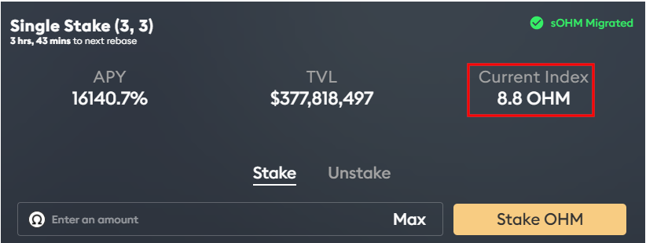
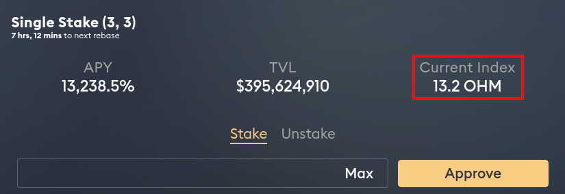

# Pertanyaan Yang Sering Diajukan

## Mengapa kita membutuhkan OlympusDAO?

Stablecoin yang dipatok dolar telah menjadi bagian penting dari kripto karena kurangnya volatilitas \(jarak antara naik dan turunnya harga saham atau valas\) dibandingkan dengan token seperti Bitcoin dan Ether. Pengguna merasa percaya diri bertransaksi menggunakan stablecoin karena mengetahui bahwa mereka memiliki jumlah daya beli yang sama hari ini vs. besok. Tapi ini adalah kekeliruan. Dolar dikendalikan oleh pemerintah AS dan Federal Reserve. Ini berarti depresiasi dolar juga berarti depresiasi stablecoin ini..

OlympusDAO bertujuan untuk menyelesaikan ini dengan membuat stablecoin yang tidak dipatok yang disebut OHM. Dengan berfokus pada pertumbuhan pasokan daripada apresiasi harga, OlympusDAO berharap OHM dapat berfungsi sebagai mata uang yang mampu menahan daya belinya tanpa bergantung pada volatilitas pasar.

## Apakah OHM koin yang stabil?

Bukan, OHM bukanlah koin yang stabil. Harapannya, OHM bisa menjadi mata uang cadangan algoritmik yang didukung oleh aset terdesentralisasi lainnya. Serupa dengan ide standar emas, OHM memberikan nilai mengambang bebas yang selalu dapat diandalkan\(digunakan kembali\) oleh penggunanya, hal ini bisa terjadi hanya karena cadangan perbendaharaan fraksional OHM mengambil nilai intrinsiknya sendiri.

## OHM dicadangkan \(backed\), bukan dipatok \(pegged\).

Setiap OHM dicadangkan atau di oleh 1 DAI, tidak dipatok. Karena perbendaharaan mencadangkan setiap OHM dengan setidaknya 1 DAI, protokol akan membeli kembali dan membakar OHM ketika diperdagangkan di bawah 1 DAI. Hal ini berdampak mendorong harga OHM kembali naik hingga 1 DAI. OHM selalu bisa berdagang di atas 1 DAI karena tidak ada batas atas yang diberlakukan oleh protokol. Pikirkan dipatok == 1, sementara dicadang &gt; = 1.

Anda mungkin mengatakan bahwa harga dasar atau nilai intrinsik OHM adalah 1 DAI. Kami percaya bahwa harga sebenarnya akan selalu 1 DAI + premium, tetapi pada akhirnya terserah pasar untuk memutuskan.

## Bagaimana Cara Kerjanya?

Pada tahap yang lebih tinggi, OlympusDAO terdiri dari perbendaharaan \(treasury\) yang dikelola oleh protokolnya, likuiditas yang dimiliki oleh protokol, mekanisme obligasi, dan imbalan taruhan tinggi yang dirancang untuk mengontrol ekspansi \(perluasan\) pasokan.

Obligasi menghasilkan keuntungan untuk protokol, dan perbendaharaan menggunakan keuntungan tersebut untuk mencetak OHM dan mendistribusikannya kepada para pelaku staking \(staker\). Dengan LP bond, protokol mampu mengakumulasi likuiditas untuk memastikan stabilitas sistem.

## Apa masalahnya dengan \(3, 3\) dan \(1, 1\)?

\(3, 3\) adalah gagasan bahwa, jika semua orang bekerja sama di Olympus, itu akan menghasilkan keuntungan terbesar bagi semua orang \(dari sudut pandang[ teori permainan](https://en.wikipedia.org/wiki/Game_theory) \). Saat ini, ada tiga tindakan yang dapat dilakukan pengguna:

* Mempertaruhkan \(staking\) \(+2\)
* Mengikatkan \(bonding\) \(+1\)
* Menjual \(selling\) \(-2\)

Staking dan bonding dianggap menguntungkan protokol \(positif\), sedangkan menjual dianggap merugikan \(negatif\). Staking dan selling juga akan menciptakan pergerakan harga, sedangkan bonding tidak \(kami menganggap membeli OHM dari pasar sebagai prasyarat staking, sehingga bisa menciptakan pergerakan harga\). Jika kedua tindakan yang dilakukan sama-sama menguntungkan \(positif\), pelaku yang menggerakkan harga juga mendapat setengah dari keuntungan \(+1\). Jika kedua tindakan tersebut bertentangan\(positif dan negatif\), pelaku negatif \(bad actor: sell\) yang menggerakkan harga mendapat setengah dari keuntungan \(+1\), sedangkan pelaku positif\(aktor baik: bond dan stake\) yang menggerakkan harga mendapat setengah dari kerugian \(-1\). Jika kedua tindakan tersebut merugikan, yang berarti kedua pelaku menjual, keduanya mendapatkan setengah dari kerugian \(-1\).

Jadi, terkait dengan adanya dua aktor, semua skenario tentang apa yang dapat mereka lakukan dan efeknya pada protokol ditampilkan di sini:

* Jika dua pihak sama-sama staking \(3, 3\), ini merupakan hal terbaik bagi kedua belah pihak dan juga protokol \(3 + 3 = 6\).
* · Jika salah satu melakukan staking dan yang satu lagi melakukan bonding, hal ini juga bagus karena staking mengeluarkan OHM dari pasar dan memasukkannya ke dalam protokol, sementara bonding menyediakan likuiditas dan DAI untuk treasury \(perbendaharaan\) \(3 + 1 = 4\).
* · Ketika salah satu melakukan selling, hal ini mengurangi upaya pihak satu lagi yang melakukan staking ataupun bonding \(1 - 1 = 0\).
* · Ketika kedua belah pihak menjual atau selling, hal ini menciptakan hasil terburuk bagi kedua belah pihak dan juga protokol \(-3 - 3 = -6\).

## Mengapa PCV penting?

Karena protokol mengontrol dana dalam perbendaharaannya, maka OHM hanya dapat dicetak \(minted\) atau dibakar \(burned\) oleh protokol sendiri. Ini juga menjamin bahwa protokol akan selalu dapat mencadangkan 1 OHM dengan 1 DAI. Kamu dapat dengan mudah memperkirakan risiko investasimu karena kamu yakin bahwa protokol akan membeli OHM kapanpun di bawah 1 DAI dengan aset dari treasury hingga tidak ada lagi yang tersisa untuk dijual. kamu tidak bisa mempercayai FED tetapi kamu bisa mempercayai kodenya.

Karena protokol mengakumulasi lebih banyak PCV, maka lebih banyak landasan pacu yang dijamin untuk para pelaku staking atau staker. Ini berarti para staker dapat memastikan bahwa APY staking saat ini dapat dipertahankan untuk jangka waktu yang lama karena lebih banyak dana yang tersedia di perbendaharaan \(treasury\).

## Apa yang akan terjadi jika ada bank run \(penarikan secara besar-besaran\) di Olympus?

Perbankan cadangan fraksional bisa berjalan karena deposan tidak menarik dana mereka sekaligus. Kepercayaan deposan dalam sistem perbankan bertumpu pada peraturan dan lembaga seperti Federal Deposit Insurance Corporation \(FDIC\).

OHM tidak memiliki asuransi FDIC tetapi OHM memiliki struktur insentif atau kompensasi untuk melindungi pelaku staker. Mari kita lihat bagaimana cara kerjanya ketika terjadi bank run. Dalam skenario ini, kami menganggap bahwa mayoritas pemegang saham \(staker\) akan panik dan melepas token mereka dari Olympus - persentase staking yang sebelumnya mencapai 92% sekarang dengan cepat turun menjadi 3,3%, dan hanya menyisakan 55.000 OHM yang dipertaruhkan \(tersisa di perbendaharaan\).

Selanjutnya, kami menganggap aliran masuk Risk-Free Value \(RFV\) ke perbendaharaan \(treasury\) benar-benar mengering. Sesuai konteks, RFV saat ini tumbuh sekitar $1 juta setiap 3 hari. Namun, selama masa bank run maka pertumbuhan angka ini kemungkinan akan berhenti

Akhirnya, anggaplah bahwa pemegang saham terakhir yang bertahan membeli dengan harga $500 per OHM. Investasi awal dari para staker ini adalah:

$$
\$500/OHM * 55,000\ OHM = \$27.5\ million
$$

Per 15 September 2021, total pasokan OHM adalah 2,082,553 dan RFV adalah $47,041,833. Ingat bahwa 1 OHM dicadangkan dalam 1 USD \(DAI atau FRAX\). Dengan mengurangkan dua angka ini, kita tahu 44,959,280 OHM pada akhirnya akan diberikan kepada para staker yang tersisa. Kira-kira dalam setahun, para staker yang memegang 55,000 OHM ini akan memiliki:

$$
55,000 + 44,959,280 = 45,014,280\ OHM
$$

Investasi $ 27.5 juta yang dilakukan oleh para staker ini akan berubah menjadi sekitar $ 45 juta berdasarkan arus kas saja jika mereka tetap distaking \(ingat bahwa 1 OHM didukung oleh 1 USD\). Dalam skenario bank run, para staker yang tetap staking tidak hanya mendapatkan uang mereka kembali, tetapi juga mendapatkan keuntungan. Oleh karena itu, \(3,3\) bukan hanya meme populer, tetapi juga merupakan strategi yang dominan.

Skenario di atas tidak mungkin terjadi karena jika orang lain mengetahui bahwa imbalan yang sangat tinggi dibayarkan kepada para staker, mereka akan menyalin strategi dengan membeli \(buy\) dan mempertaruhkan \(stake\) OHM. Ini juga mengapa persentase OHM yang dipertaruhkan di Olympus secara konsisten tetap lebih dari 90% sejak diluncurkan.

Catatan: Sebagian besar data yang dirujuk di atas diambil dari[ laman Dune Analytics ini](https://duneanalytics.com/shadow/Olympus-%28OHM%29) .

## Mengapa harga pasar OHM begitu fluktuatif?

Sangat penting untuk memahami seberapa awal pengembangan protokol OlympusDAO. Sangat banyak diskusi yang membahas seputaran harga saat ini dan mengharapkan nilai yang selalu stabil untuk bergerak maju. Kenyataannya adalah bahwa karakteristik ini belum dipastikan. Jaringan saat ini disetel untuk perluasan pasokan OHM, yang ketika dipasangkan dengan mekanisme staking, bonding, dan yield dari OlympusDAO akan menghasilkan volatilitas yang cukup besar.

OHM dapat berdagang dengan harga yang sangat tinggi karena pasar siap membayar premi yang besar untuk menangkap persentase dari kapitalisasi pasar saat ini. Namun, harga OHM juga bisa turun cukup besar jika sentimen pasar berubah menjadi bearish \(pasar bear atau turun\). Kami mengharapkan volatilitas harga yang signifikan selama fase pertumbuhan kami, jadi silakan lakukan penelitianmu sendiri apakah proyek ini sesuai dengan tujuanmu.

## Apa gunanya membelinya sekarang ketika OHM diperdagangkan dengan premi yang sangat tinggi?

Saat Anda membeli dan mempertaruhkan OHM, Anda menangkap persentase pasokan \(kapitalisasi pasar\) yang akan tetap mendekati konstan. Hal ini terjadi karena saldo OHM yang Anda pertaruhkan \(stake\) juga meningkat seiring dengan pasokan yang beredar. Implikasinya adalah jika Anda membeli OHM saat kapitalisasi pasar rendah, Anda akan menangkap persentase kapitalisasi pasar yang lebih besar.

## Apa itu rebase?

Rebase adalah mekanisme di mana saldo OHM \(sOHM\), milikmu yang dipertaruhkan \(stake\) meningkat secara otomatis. Ketika OHM baru dicetak oleh protokol, sebagian besar masuk kepada staker. Karena staker hanya melihat saldo OHM yang distaking \(sOHM\), bukan OHM, protokol menggunakan mekanisme rebase untuk meningkatkan saldo OHM yang distaking sehingga 1 OHM yang distaking \(sOHM\) selalu dapat ditukarkan dengan 1 OHM.

## Apa itu yield?

Yield atau imbalan adalah persentase peningkatan saldo OHM Anda yang dipertaruhkan pada epoch berikutnya. Hal ini juga dikenal sebagai rebase rate. Anda dapat menemukan angka ini di halaman Olympus staking.

## Apa itu APY?

APY adalah singkatan dari annual percentage yield atau persentase hasil tahunan. APY mengukur tingkat pengembalian riil atas modal pokok Anda dengan memperhitungkan efek bunga majemuk. Dalam kasus OlympusDAO, OHM Anda yang distaking mewakili pokok Anda, dan bunga majemuk ditambahkan secara berkala pada setiap epoch \(2200 blok Ethereum, atau sekitar 8 jam\) berkat mekanisme rebase.

Satu fakta menarik tentang APY adalah bahwa saldo Anda akan tumbuh tidak secara linier tetapi secara eksponensial dari waktu ke waktu! Dengan asumsi bunga majemuk harian 2%, jika Anda mulai dengan saldo 1 OHM pada hari ke-1, setelah satu tahun, saldo Anda akan tumbuh menjadi sekitar 1377. Sangat banyak!v

## Bagaimana APY dihitung?

APY dihitung dari hasil reward \(alias rebase rate\) menggunakan persamaan berikut:

$$
APY = ( 1 + rewardYield )^{1095}
$$

Pangkat 1095 terjadi karena rebase terjadi 3 kali sehari. Perhitungannya adalah 365 hari dalam setahun, maka frekuensi rebase 365 \* 3 = 1095.

Hasil imbalannya \(yield\) ditentukan oleh persamaan berikut:

$$
rewardYield = OHM_{distributed} / OHM_{totalStaked}
$$

Jumlah OHM yang didistribusikan ke kontrak staking dihitung dari total supplyatau pasokan OHM dengan menggunakan persamaan berikut:

$$
OHM_{distributed} = OHM_{totalSupply} \times rewardRate
$$

Perhatikan bahwa tingkat hadiah atau imbalan dapat berubah sesuai protokol. Misalnya, telah direvisi karena[ proposal terbaru ini](https://forum.olympusdao.finance/d/77-oip-18-reward-rate-framework-and-reduction) .

## Mengapa harga OHM menjadi tidak relevan dalam jangka panjang?

Seperti diilustrasikan di atas, saldo OHM Anda akan tumbuh secara eksponensial dari waktu ke waktu berkat kekuatan compounding \(bunga majemuk\). Katakanlah Anda membeli satu OHM seharga $400 saat ini dan pasar memutuskan bahwa dalam waktu 1 tahun, nilai intrinsik satu OHM akan menjadi $2. Dengan asumsi tingkat bunga majemuk \(compound\) harian sebesar 2%, saldo Anda akan tumbuh menjadi sekitar 1377 OHM pada akhir tahun, yang bernilai sekitar $2754. Itu adalah keuntungan $2354 yang luar biasa! Nah Sekarang, Anda bisa memahami bahwa Anda membayar premi untuk OHM pada saat ini dengan imbalan yaitu manfaat jangka panjang. Dengan demikian, maka jika Anda meletakkan token dalam jangka waktu yang lama sehingga memungkinkan saldo OHM Anda tumbuh secara eksponensial dan menjadikannya sebagai investasi yang berharga. Anda masih akan tetap untung.

## Apa yang akan menjadi nilai intrinsik OHM di masa depan?

Tidak ada jawaban yang pasti dan jelas untuk ini, akan tetapi nilai intrinsik dapat ditentukan oleh kinerja treasury. Misalnya, jika treasury dapat menjamin untuk mendukung setiap OHM dengan 100 DAI, nilai intrinsiknya adalah 100 DAI. Hal tersebut juga bisa ditentukan oleh DAO. Misalnya, jika DAO memutuskan untuk[ menaikkan harga dasar OHM](https://forum.olympusdao.finance/d/31-use-price-floor-as-tool-for-monetary-policy) , nilai intrinsiknya akan ikut naik.

## Bagaimana protokol mengelola APY dengan staking tinggi?

Katakanlah protokol menargetkan APY 100.000%. Ini akan diterjemahkan ke rebase rate sekitar 0,6328%, atau pertumbuhan harian sekitar 2%. Silakan lihat persamaan di atas untuk mempelajari bagaimana APY dihitung dari rebase rate .

Jika ada 100.000 OHM yang dipertaruhkan sekarang, protokol perlu mencetak 2000 OHM tambahan untuk mencapai pertumbuhan harian ini. Hal ini dapat dicapai jika protokol tersebut dapat mendatangkan setidaknya 2000 DAI setiap hari dari penjualan obligasi \(bond sales\). Jika protokol gagal mencapai ini, APY 100.000% tidak bisa dijamin.

## Apakah saya harus meng-unstake dan stake OHM di setiap epoch untuk mendapatkan imbalan rebase saya?

Tidak. Setelah Anda mempertaruhkan OHM dengan OlympusDAO, saldo OHM yang Anda pertaruhkan akan digabungkan secara otomatis di setiap epoch. Peningkatan saldo itu mewakili atau melambangkan imbalan rebase Anda.

## Bagaimana cara melacak hadiah rebase saya?

Anda dapat melacak imbalan rebase Anda dengan menghitung peningkatan saldo OHM yang Anda stake.

1. Catat nilai Current Index pada halaman staking saat pertama kali melakukan staking OHM. Sebut saja ini Indeks Mula atau Start Indeks.

 2. Setelah melakukan staking beberapa saat, jika ingin mengetahui berapa kenaikan saldo  anda, periksa kembali nilai Current Index. Sebut saja ini Indeks Akhir atau End Index.

3. Dengan membagi Indeks Akhir dengan Indeks Awal, Anda akan mendapatkan rasio peningkatan saldo OHM Anda yang dipertaruhkan.

$$
ratio = endIndex / startIndex
$$

4. Dalam contoh ini, saldo OHM bertambah 1,5 kali lipat.

$$
ratio = 13.2\ /\ 8.8\newline = 1.5
$$

