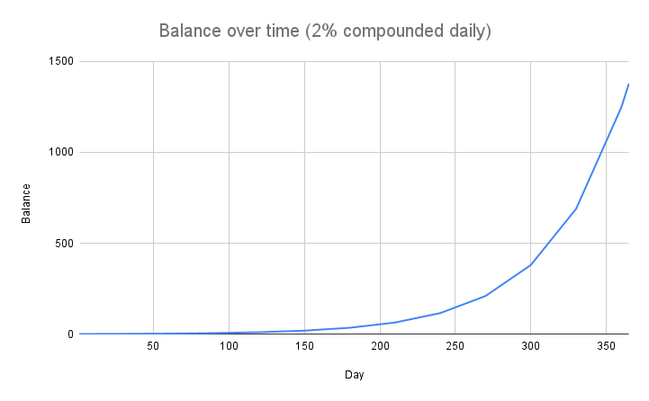

# FAQ

## Wozu brauchen wir überhaupt Olympus?

An den Dollar gebundene Stablecoins sind eine unverzichtbare Variante von Kryptowährungen, da sie im Vergleich zu Token wie Bitcoin und Ether nur geringe Preisschwankungen aufweisen. Nutzer setzen sie häufig für Transaktionen ein, da sie der Meinung sind, dass die Stablecoins morgen die gleiche Kaufkraft besitzen werden wie heute. Doch dabei handelt es sich um einen Trugschluss. Der Dollar wird von der US-Bundesregierung und deren Zentralbank kontrolliert. Daher bewirkt eine Abwertung des Dollars auch eine Abwertung der Stablecoins.

OlympusDAO versucht, dieses Problem durch eine ungebundene Stablecoin namens OHM zu lösen. Indem der Schwerpunkt auf dem Bestandswachstum und weniger auf der Wertsteigerung liegt, hofft OlympusDAO, dass OHM als Währung seine Kaufkraft behält, unabhängig von Schwankungen am Markt.

## Ist OHM eine Stablecoin?

Nein, OHM ist keine Stablecoin. Ohm soll eine algorithmische Reserve-Währung sein, die von anderen dezentralisierten Assets gestützt wird. Ähnlich wie bei der Idee des Goldstandards bietet OHM einen frei beweglichen Grundwert, auf den seine Besitzer stets zurückgreifen können, ganz einfach aufgrund der anteiligen Reserven im Olympus-Vermögen, auf denen der intrinsische Wert von OHM beruht.

## Ist OHM gestützt oder gebunden?

Jedes OHM wird von 1 DAI gestützt, ist aber nicht daran gebunden. Weil das Olympus-Protokoll für jedes OHM mindestens 1 DAI in seinem Vermögen hält, kann es OHM zurückkaufen und vernichten, sobald der Kurs unter 1 DAI sinkt. Dies bewirkt, dass der Preis für OHM wieder auf 1 DAI gehoben wird. Der Kurs von OHM kann allerdings jederzeit über 1 DAI steigen, da das Protokoll keine Obergrenze vorgibt. Einfach ausgedrückt bedeutet gebunden == 1, gestützt hingegen >= 1.

Man könnte auch sagen, der Mindestpreis oder intrinsische Wert von OHM ist 1 DAI. Wir glauben, dass der tatsächliche Preis immer 1 DAI + ein bestimmter Aufpreis sein wird, doch das wird der Markt entscheiden.

## Wie funktioniert das Ganze?

Grundsätzlich setzt sich OlympusDAO zusammen aus dem vom Protokoll verwalteten Vermögen, der Protokoll-eigenen Liquidität (Protocol Owned Liquidity, [POL](../../references/glossary.md#pol)), den Bond-Mechanismen und den Vergütungen für das Staking, die auf die Vergrößerung des OHM-Bestands ausgelegt sind.

Die Verkäufe von Bonds führen zu Einnahmen, die das Protokoll nutzt, um OHM zu prägen und an die Staker auszuschütten. Durch [Liquiditäts-Anleihen](../../references/glossary.md#liquidity-bonds) kann das Protokoll eigene Liquidität anhäufen. Der Punkt "[Warum ist POL wichtig?](./#why-is-pol-important)" erklärt das weiter unten noch genauer.

## Was hat es mit (3,3) und (1,1) auf sich?

(3,3) veranschaulicht die Idee, dass ein kooperatves Verhalten aller Teilnehmer den größtmöglichen Gewinn für alle Beteiligten erzeugt (aus spieltheoretischer Sicht). Derzeit gibt es drei Möglichkeiten, wie sich ein Teilnehmer verhalten kann:

* Staken (+2)
* Bonden (+1)
* Verkaufen (-2)

Staken und Bonden sind vorteilhaft für das Protokoll, während Verkaufen als nachteilig gilt. Staken und Verkaufen beeinflusst außerdem den Preis, während Bonden keine Auswirkung darauf hat (wir nehmen an, dass OHM zunächst auf dem Markt gekauft wird, bevor es gestaked werden kann, daher der Einfluss auf den Preis). Sind im Fall von zwei Akteuren beide Aktionen vorteilhaft, dann erhält jeder, der für eine Preisbewegung sorgt, auch die Hälfte des Nutzens (+1). Sind die Aktionen gegenläufig, erhält der schädliche Akteur die Hälfte des Gewinns (+1) und der hilfreiche Akteur trägt die Hälfte des Verlustes (-1). Wenn beide Aktionen nachteilig sind, also beide Akteure verkaufen, trägt jeder die Hälfte des Verlustes (-1).

Für zwei Akteure ergibt sich daraus folgendes Schema, das zeigt, welche Möglichkeiten beide haben und welche Folgen dies jeweils hat:

* Wenn beide staken (3, 3), dann ist das am besten sowohl für die Akteure als auch für das Protokoll (3 + 3 = 6).
* Wenn einer von beiden staked und der andere bondet, dann ist das auch gut, denn Staken nimmt OHM vom Markt und hinterlegt es im Protokoll, während Bonden dem Olympus-Vermögen Liquidität und DAI beschert (3 + 1 = 4).
* Wenn einer von beiden verkauft, dann mindert es die positiven Auswirkungen des anderen, der staked oder bondet (1 - 1 = 0).
* Wenn beide verkaufen, hat das die schlechtesten Auswirkungen, sowohl für die Akteure als auch für das Protokoll (-3 - 3 = -6).

## Warum ist PCV wichtig?

Protocol Controlled Value (PCV) ist die Menge an Assets, die das Olympus-Vermögen besitzt und kontrolliert. Da das Protokoll die Werte in seinem Vermögen besitzt, kann OHM nur vom Protokoll geprägt oder vernichtet werden. Das stellt auch sicher, dass das Protokoll für 1 OHM stets 1 DAI garantieren kann. Das Risiko einer Investition ist daher einfach abzuschätzen, da jeder sicher sein kann, dass das Protokoll OHM, das unter 1 DAI fällt, mit Mitteln aus seinem Vermögen so lange zurückkaufen wird, bis keines mehr übrig ist. Man muss nicht notwendigerweise der Zentralbank vertrauen, aber man kann sich immer auf den Programmcode verlassen.

Indem das Protokoll mehr PCV anhäuft, kann es eine längere Zeitspanne an Ausschüttungen garantieren. Die Staker können daher sicher sein, dass die gegenwärtige Zinsrate für das Staken länger aufrecht erhalten werden kann, weil das Olympus-Vermögen über mehr Werte verfügt.

## Warum ist POL wichtig?

Protokoll-eigene Liquidität (Protocol Owned Liquidity, POL) ist die Menge an LP(Liquiditäts-Provider)-Token (z.B. OHM-DAI LP-Bonds) im Olympus-Vermögen. Dank des Anleihe-Mechanismus ist Olympus [Eigentümer des größten Teils seiner Liquidität](https://dune.xyz/shadow/Olympus-\(OHM\)). Das hat mehrere Vorteile:

* Olympus muss keine hohen Farming-Zinsen ausschütten, um Liquidität von Geldgebern anzulocken, sprich Liquidität zu mieten.
* Olympus garantiert dem Markt, dass stets Liquidität vorhanden ist, um Kauf- oder Verkaufs-Transaktionen zu ermöglichen.
* Als größter Liquiditäts-Provider (LP) verdient Olympus den Löwenanteil der LP-Gebühren, eine weitere Einkommensquelle für das Gemeinschaftsvermögen.
* Die gesamte POL kann genutzt werden, um OHM zu stützen. Die LP-Token werden dazu mit ihrem Risiko-freien Wert (RFV, Risk Free Value), sprich dem garantierten Kapital angesetzt. Mehr über die Beweggründe dazu findet sich in diesem [Medium-Artikel](https://olympusdao.medium.com/dai-bonds-a-more-effective-sales-mechanism-c9a57586f1f7).

## Was würde im Fall eines Kassenansturms bei Olympus passieren?

Bankensysteme mit Mindestreserven funktionieren, weil nicht alle Anleger gleichzeitig ihr Geld abheben. Das Vertrauen eines Anlegers in das Bankensystem beruht auf Reglementierung und auf Sicherungssystemen wie der Federal Deposit Insurance Corporation (FDIC), der Bundeseinlagenversicherungsgesellschaft der USA.

OHM hat zwar keine Einlagensicherung, aber dafür ein Anreizsystem, das Staker schützt. Ein Blick auf einen hypothetischen Ansturm auf die Bank soll zeigen, wie das funktioniert. Für dieses Szenario nehmen wir an, dass die Mehrzahl der Staker in Panik gerät und ihre Token auf Olympus unstaken wird, also abhebt. Der Anteil an gestaktem OHM fällt von 92% abrupt auf 3,3%, und es bleiben nur 55.000 OHM gestaked.

Außerdem nehmen wir an, dass Zuflüsse an garantiertem Kapital (RFV, Risk Free Value) in das Protokoll-Vermögen komplett versiegen. Um einen Vergleich zu nennen: Derzeit wächst das RFV um [etwa 1 Million US$ alle zwei Tage](https://dune.xyz/queries/29153/58862). Während eines Kassensturms würde dies allerdings sehr wahrscheinlich aufhören.

Schließlich nehmen wir weiter an, dass die letzten verbleibenden Staker zu einem Preis von 500 US$ pro OHM eingekauft haben. Die Anfangsinvestition dieser Staker wäre dann:

$$
\$500/OHM * 55.000\ OHM = \$27,5\ Millionen
$$

Am 15. September 2021 betrug der gesamte Bestand an OHM 2.082.553 und das RFV 47.041.833 US$. Erinnern wir uns daran, dass für jedes 1 OHM stets 1 US$ hinterlegt ist (in Form von DAI oder FRAX). Ziehen wir die beiden vorstehenden Zahlen voneinander ab, erhalten wir einen Wert von 44.959.280 OHM, die früher oder später an die verbleibenden Staker ausgeschüttet werden. In etwa einem Jahr werden diese Staker, die derzeit 55.000 OHM halten, folgende Menge besitzen:

$$
55.000 + 44.959.280 = 45.014.280\ OHM
$$

Wenn sie weiter staken, verwandelt sich eine Anfangsinvestition von 27,5 Millionen US$ in ein Vermögen von etwa 45 Millionen US$, allein aufgrund des Cash Flows (denn 1 OHM ist jederzeit von 1 US$ gestützt). In diesem Szenario eines hypothetischen Kassensturms bekommen die Staker, die ihre Position halten, nicht nur ihr Geld zurück, sondern machen auch noch Gewinn. Aus diesem Grund ist [(3,3)](./#what-is-the-deal-with-3-3-and-1-1) nicht nur ein beliebtes Meme, sondern tatsächlich die am weitesten verbreitete OHM-Strategie

Es ist sehr unwahrscheinlich, dass sich das obige Szenario tatsächlich so abspielt, denn sobald andere Investoren merken, dass die verbleibenden Staker extrem hohe Gewinne machen, werden sie die Strategie imitieren und OHM kaufen und staken. Das ist auch der Grund, warum der Anteil an gestaktem OHM seit dem Launch konstant über 90% lag.

Anmerkung: Die meisten Daten in obigem Beispiel stammen von [dieser Dune Analytics Seite](https://duneanalytics.com/shadow/Olympus-\(OHM\)).

## Warum ist der Marktpreis von OHM so volatil?

Man sollte auf keinen Fall vergessen, dass die Entwicklung von OHM noch ganz am Anfang steht. Die aktuelle Diskussion geht oft davon aus, dass sich der Preis auf einen stabilen Wert einpendelt. In Wirklichkeit ist diese Eigenschaft noch alles andere als geklärt. OlympusDAO ist derzeit vor allem darauf ausgelegt, den OHM Bestand zu erhöhen, was im Zusammenspiel mit Staking, Bonding und Ertragsmechanismen zu einer erheblichen Volatilität führt.

OHM könnte für einen hohen Preis gehandelt werden, weil Marktteilnehmer bereit sind, einen deutlichen Aufschlag dafür zu zahlen, dass sie einen Anteil an der gegenwärtigen Marktkapitalisierung erhalten. Im Gegensatz dazu könnte der Preis aber auch stark sinken, wenn die Stimmung am Markt in Pessimismus umschlägt. Wir erwarten deutliche Preisschwankungen während der Wachstumsphase. Jeder Anleger sollte **sich umfassend informieren** und dann entscheiden, ob dieses Projekt für die eigene Anlagestrategie geeignet ist.

## Warum sollte ich OHM gerade jetzt mit hohem Aufschlag kaufen?

Wer OHM kauft und staked, erwirbt einen Anteil am gesamten OHM-Bestand (an der Marktkapitalisierung), der annähernd konstant bleibt. Der Grund dafür ist, dass die gestakte Menge an OHM gemeinsam mit dem im Umlauf befindlichen Bestand wächst. Das bedeutet, je früher man OHM kauft, desto größer ist der Anteil an der Marktkapitalisierung, die man erwirbt.

## Was ist eine Rebase?

Regelmäßige Ausschüttungsrunden, so genannte Rebases, sind der Mechanismus, durch den sich das gestakte OHM-Guthaben automatisch vermehrt. Wenn neues OHM vom Protokoll geprägt und in Umlauf gebracht wird, geht ein Großteil davon an die Staker. Staker sehen ihr gestaktes OHM-Guthaben und nicht mehr ihren früheren Bestand an OHM. Durch den Rebasing-Mechanismus erhöht das Protokoll das gestakte OHM-Guthaben, und 1 gestaktes OHM ist stets für 1 OHM einlösbar.

## Was ist die Reward Yield?

Der Belohnungsertrag (reward yield) ist der Prozentsatz, um den sich das gestakte OHM Guthaben in der nächsten Epoche erhöht. Er wird auch Ausschüttungsrate (rebase rate) genannt. Der aktuelle Wert ist auf der [Olympus Staking Seite](https://app.olympusdao.finance/#/stake) angegeben.

## Was ist die APY?

Die jährliche Ertragsrate (Annual Percentage Yield, APY) gibt die tatsächliche Ertragsrate für das eingesetzte Kapital an, unter Berücksichtigung von Zins und Zinseszins. Im Fall von OlympusDAO steht das gestakte OHM für das eingesetzte Kapital, und die Zinsen werden durch den Ausschüttungs-Mechanismus regelmäßig hinzu gefügt, am Ende jeder Epoche (alle 2200 Ethereum-Blöcke oder in etwa alle 8 Stunden).

Eine interessante Folge der APY ist, dass das Guthaben im Verlauf der Zeit nicht linear, sondern exponentiell wächst. Nimmt man beispielsweise eine tägliche Zinsrate von 2% an, dann wächst ein Startguthaben von 1 OHM nach einem Jahr auf etwa 1377 OHM an. Das ist sehr viel!

## Wie wird die APY berechnet?

Die jährliche Ertragsrate (APY) errechnet sich aus dem Belohnungsertrag (reward yield bzw. rebase rate) nach folgender Formel:

$$
APY = ( 1 + rewardYield )^{1095}
$$

Der Exponent 1095 ergibt sich, weil eine Ausschüttung dreimal täglich stattfindet. Rechnet man mit 365 Tagen pro Jahr, dann wäre die Häufigkeit der Ausschüttung 365\*3 = 1095.

Der Belohnungsertrag (reward yield) wiederum entspricht dem Verhältnis von ausgeschüttetem OHM (OHM distributed) und gestaktem OHM (OHM total staked) nach folgender Formel:

$$
rewardYield = OHM_{distributed} / OHM_{totalStaked}
$$

Die Menge an OHM schließlich, die an den Staking-Vertrag ausgeschüttet wird (OHM distributed), berechnet sich aus dem Gesamtbestand an OHM (OHM total supply) und der Belohnungsrate (reward rate) nach folgender Formel:

$$
OHM_{distributed} = OHM_{totalSupply} \times rewardRate
$$

Es sei darauf hingewiesen, dass die Belohnungsrate vom Protokoll festgelegt ist und verändert werden kann. Sie wurde beispielsweise entsprechend [dieses Vorschlags](https://forum.olympusdao.finance/d/77-oip-18-reward-rate-framework-and-reduction) angepasst.

## Warum ist der Preis von OHM auf lange Sicht unerheblich?

Wie bereits oben beschrieben wächst das OHM-Guthaben dank des Zinseszins-Effektes mit der Zeit exponentiell. Nehmen wir an, jemand kauft heute 1 OHM zum Preis von 400 US$ und im Verlauf eines Jahres entscheidet der Markt, dass der intrinsische Wert von 1 OHM nur 2 US$ beträgt. Eine tägliche Verzinsung von 2% vorausgesetzt, würde das Guthaben von 1 OHM in einem Jahr auf 1.377 OHM anwachsen und wäre dann 2.754 US$ wert. Das sind coole 2.354 US$ Gewinn! Das macht noch einmal verständlich, warum Investoren bereit sind, einen Aufpreis für die spätere Wertentwicklung zu bezahlen. Man sollte also einen langfristigen Anlagehorizont haben, damit das OHM-Guthaben wachsen und eine lohnende Anlage daraus werden kann.

## Wie hoch wird in der Zukunft der intrinsische Wert von OHM sein?

Darauf gibt es keine eindeutige Antwort, aber der intrinsische Wert lässt sich aus der Wertentwicklung des Olympus-Vermögens ableiten. Wenn dieses Vermögen beispielsweise garantieren würde, dass für jedes OHM 100 DAI hinterlegt sind, dann hätte 1 OHM den intrinsischen Wert von 100 DAI. Das kann auch von der DAO bestimmt werden. Wenn die DAO z.B. entscheidet, den [Mindestpreis für OHM anzuheben](https://forum.olympusdao.finance/d/31-use-price-floor-as-tool-for-monetary-policy), wird dessen intrinsischer Wert steigen.

## Wie finanziert das Protokoll die hohen Zinserträge für das Staken?

Nehmen wir an, das Protokoll will die jährliche Ertragsrate (APY) im Bereich von 1.000% bis 10.000% halten (siehe [OIP-18](https://forum.olympusdao.finance/d/77-oip-18-reward-rate-framework-and-reduction) für weitere Details). Das bedeutet, der Belohnungsertrag (reward yield) würde mindestens bei etwa 0,2105% liegen und das tägliche Zinswachstum bei etwa 0,6328%. Wie sich die APY aus dem Belohnungsertrag errechnet wird [weiter oben](./#how-is-the-apy-calculated) erklärt.

Wenn derzeit 100.000 OHM gestaked wären, dann müsste das Protokoll zusätzliche 632,8 OHM pro Tag münzen, um dieses tägliche Wachstum zu erreichen. Das erfordert, dass das Protokoll mindestens 632,80 US$ täglich durch den Verkauf von Anleihen (Bonds) einnimmt. Doch selbst wenn das Protokoll weniger Zuflüsse haben sollte, kann es diese APY von 1.000% dennoch über einen längeren Zeitraum aufrecht erhalten (diesen Spielraum zeigt z.B. die sogenannte [Runway Chart](https://dune.xyz/queries/102766/207436)), einfach durch den Überschuss an Reserven im Olympus-Vermögen.

## Muss ich mein OHM in jeder Epoche unstaken und wieder staken, um meine Zinsen zu erhalten?

Nein. Sobald OHM einmal bei OlympusDAO gestaked ist, wird das hinterlegte OHM in jeder Epoche automatisch verzinst. Der resultierende Anstieg im Guthaben an OHM entspricht der regelmäßigen Zinsausschüttung.

## Wie kann ich meine Zinsentwicklung verfolgen?

Die Zinsentwicklung ergibt sich aus dem Zuwachs des gestakten OHM-Guthabens.

1. Dazu notiert man sich den Wert des Current Index auf der [Staking Seite](https://app.olympusdao.finance/#/), wenn man zum ersten Mal OHM staket. Das wollen wir den Start-Index nennen.&#x20;

1. Hat man OHM für einige Zeit gestaked und will wissen, um wie viel das Guthaben gestiegen ist, notiert man sich wieder den Wert des Current Index. Das wollen wir den End-Index nennen.

1. Indem man den End-Index durch den Start-Index teilt, erhält man den Faktor, um den sich das gestakte OHM-Guthaben vermehrt hat.

$$
ratio = endIndex / startIndex
$$

1. In diesem Beispiel ist das OHM-Guthaben um den Faktor 1,5 gewachsen.

$$
ratio = 13.2\ /\ 8.8\newline = 1.5
$$
