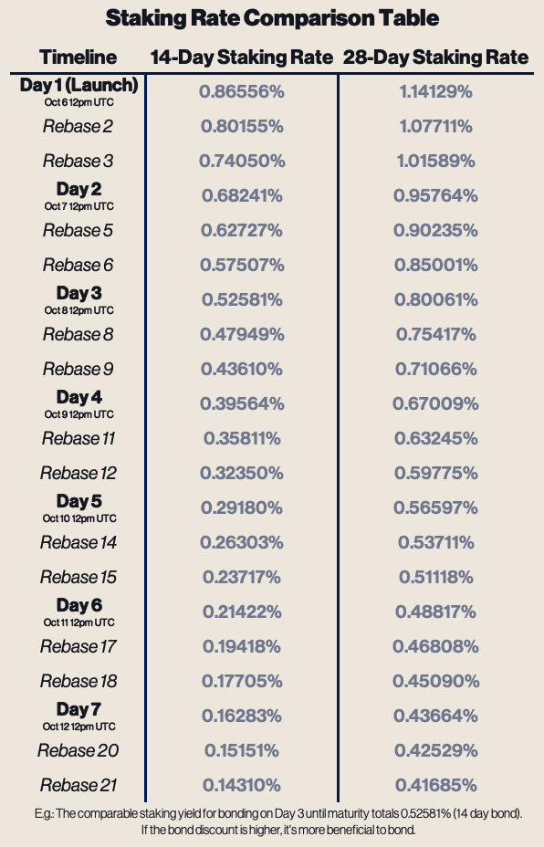

# OHM Bonds

<figure><figcaption></figcaption></figure>

### Context

Per [OIP-114 (Tantalus)](https://forum.olympusdao.finance/d/1328-oip-114-tantalus-testing-ohm-bonds), Olympus will be conducting a trial run of OHM bonds. The goal will be to understand the market demand for OHM bonds and analyze the relationship between discount rate and bond maturity by utilizing two different maturity lengths. This testing and analysis will be important data to inform the development of the bond markets and the transition to a bond-centric Olympus protocol.

### Setup

We will be utilizing two auction mechanisms for price discovery: Sequential Dutch Auction (also known as Olympus-style Bond Auction) and Gnosis Auction. You can learn more about each mechanism in Bond Protocol Guide and Gnosis Auction Guide.

Each auction will launch with two bond markets: 1) fixed-maturity dated 14-day after market launch, and 2) fixed-maturity dated 28-day after market launch. Users will be able to bond OHM and receive an ERC-20 bond token. At maturity, the bond token can be redeemed for OHM. Capacity for each bond market will be 10,000 OHM.

The launch timeline is as follows:

On **Thur, October 6th:** launch 2 Sequential Dutch Auction markets on Bond Protocol, one with October 20th, 2022 maturity, and another with November 3rd, 2022 maturity.

On **Thur, October 13th:** launch 2 Gnosis Auction markets, one with November 3rd, 2022 maturity and another with November 17th, 2022 maturity. The reason for a 7-day added lag is because of how Gnosis Auctions determine clearing price.

Keep in mind that Gnosis Auction requires a total minimum interest of 1,000 OHM to close successfully, otherwise all funds will be distributed back.

## How can I participate?

We will run Sequential Dutch Auction bond markets through Olympus UI and the Bond Protocol website. The first bond market launches October 6th.

We will run Gnosis Auction bond markets through the Gnosis website, available via [Gnosis](https://gnosis-auction.eth.link/#/overview#topAnchor). The first bond market launches October 13th.

Unsure about which auction to participate in? Here are some considerations for you to make an informed decision:

* Price discovery - Sequential Dutch Auction locks the price at your chosen market discount. Gnosis Auction runs for 7 days and calculates a final clearing price based on all bids in that timeframe.
* Canceling orders - With Gnosis Auction, you can cancel your limit order right up to the auction close. With Sequential Dutch Auction, you secure a bond at the time of purchase.

### Participating via Olympus UI

Earliest available participation date: October 6th

**Instructions**

* Navigate to [Olympus UI](https://app.olympusdao.finance/#/bonds)

### Participating via Bond Protocol UI

Earliest available participation date: October 6th

**Instructions**&#x20;

* Navigate to [Bond Protocol UI](https://app.bondprotocol.finance/) and follow instructions [Bond Protocol Auction Guide](https://docs.bondprotocol.finance/bond-marketplace/purchasing-a-bond)

### Participating via Gnosis UI

Earliest available participation date: October 13th

**Instructions**

* Navigate to [Gnosis UI](https://gnosis-auction.eth.link/#/overview#topAnchor) and follow instructions [Gnosis Auction Guide](https://gnosis-auction.eth.limo/#/docs/participate-as-a-bidder#topAnchor)
* At conclusion of auction (7 days), a clearing price will be determined and, if you win, you will receive Auction Token.
