# Contract Interactions

Olympus has numerous contracts that work together to provide the required functions of the currency: staking, bonds, tokens, treasury allocation.

The diagram below illustrates the interactions between each contract.

Click on any contract name to see details and transactions on Etherscan.
