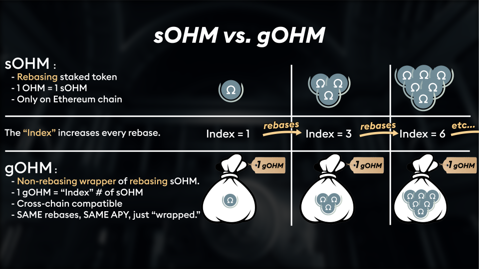

# Tokens

## Tokens

### gOHM

gOHM stands for Governance OHM. It supersedes [wsOHM](tokens.md#wsohm) as part of the [v2 migration](../basics/migration.md). gOHM is wrapped sOHM V2, which allows you to use sOHM V2 on different blockchains. It is priced exactly the same as wsOHM:

$$
gOHM_{price} = OHM_{price} * CurrentIndex
$$

You still collect rebase rewards just as if you had sOHM, but you won't see your token balance increase because the increase in value is based on the Current Index at the time of purchase and sale. [See this FAQ](../#how-do-i-track-my-rebase-rewards) for more details.

Below are listed gOHM contracts by version, where the latest version represents the currently active contract.

Ethereum:

* V1 [0x0ab8...a52f](https://etherscan.io/address/0x0ab87046fBb341D058F17CBC4c1133F25a20a52f)

Arbitrum One:

* V1 [0x8D9b...5FB1](https://arbiscan.io/token/0x8D9bA570D6cb60C7e3e0F31343Efe75AB8E65FB1)

Avalanche:

* V1 [0x321e...4251](https://snowtrace.io/token/0x321e7092a180bb43555132ec53aaa65a5bf84251)

Fantom:

* V1 [0x91fa...3FDc](https://ftmscan.com/token/0x91fa20244Fb509e8289CA630E5db3E9166233FDc)

Polygon:

* V1 [0xd8cA...5195](https://polygonscan.com/token/0xd8cA34fd379d9ca3C6Ee3b3905678320F5b45195)


**Current Index explanation / Why does it show less OHM for me during migration?**

The Current Index is how many OHM one would have if they staked 1 OHM since the protocol inception. Check out the [Olympus dashboard](https://app.olympusdao.finance/#/dashboard) for the Current Index value.

Unsure about the gOHM balance you get after the V2 migration? [Read the FAQ](../basics/migration.md#can-you-walk-me-through-an-example-of-how-much-gohm-i-can-expect-from-the-migration) for more details about the calculation.


### OHM

If you want to buy OHM on Sushiswap or any other DEX please make sure the token address of the token you purchase matches the one shown above. Never buy any OHM token which address you cannot verify yourself. Further, knowing the OHM token address you can see the list of holders and available exchanges providing liquidity for OHM on Etherscan.

Below are listed OHM contracts by version, where the V2 token is the token in use after the [V2 migration](https://olympusdao.medium.com/introducing-olympus-v2-c4ade14e9fe).

* V1 [0x3835...a899](https://etherscan.io/address/0x383518188c0c6d7730d91b2c03a03c837814a899)
* V2 [0x64aa...f1D5](https://etherscan.io/address/0x64aa3364F17a4D01c6f1751Fd97C2BD3D7e7f1D5)

### sOHM

You receive sOHM when you stake OHM at a 1:1 ratio. Adding this address to your wallet allows you to track your sOHM balance which increases with every rebase.

Below are listed sOHM contracts by version. We have two V2 tokens, the older version is for the [previous migration](https://olympusdao.medium.com/olympus-v1-1-whats-in-it-293843a8d4dc), while the newer one is used for the [latest V2 migration](https://olympusdao.medium.com/introducing-olympus-v2-c4ade14e9fe).

* V1 [0x3193...Fbbe](https://etherscan.io/address/0x31932E6e45012476ba3A3A4953cbA62AeE77Fbbe)
* V2 old [0x04f2...111f](https://etherscan.io/address/0x04f2694c8fcee23e8fd0dfea1d4f5bb8c352111f)
* V2 [0x0490...d460](https://etherscan.io/address/0x04906695D6D12CF5459975d7C3C03356E4Ccd460)

### wsOHM

wsOhm is wrapped staked OHM. The non-rebasing wrapper is used to package up staked OHM in a non-rebasing container that can be transferred between chains. Currently, this token is supported on Ethereum, Arbitrum, and Avalanche (AVAX) networks. Below are listed wsOHM contracts by version and network, where the latest version represents the currently active contract. **Please double check the network** for the address you are adding.

ETH Mainnet:

* V1 [0xca76...3e65](https://etherscan.io/address/0xca76543cf381ebbb277be79574059e32108e3e65)

Arbitrum L2:

* V1 [0x739c...BC4B](https://arbiscan.io/token/0x739ca6d71365a08f584c8fc4e1029045fa8abc4b)

AVAX Chain:

* V1 [0x8CD3...2073](https://cchain.explorer.avax.network/token/0x8CD309e14575203535EF120b5b0Ab4DDeD0C2073)

## Historical Tokens

The tokens below are only relevant if you've had OHM from the genesis block. They're still of interest to everyone.

### aOHM

When OlympusDAO first launched, alphaOHM (aOHM) was used as a pre-allocation token which allowed the early participants to lay claim to OHM. Moving forward aOHM will serve as the in-game currency of [Alpha Omega](https://medium.com/@alpha\_omega/alpha-omega-a-tale-of-two-cities-80a94966376b), a community-led social game that runs on the blockchain. Other than that aOHM is not relevant to OHM or the operation of OlympusDAO. Below are listed aOHM contracts by version, where the latest version represents the currently active contract.

* V1 [0x24ec...792e](https://etherscan.io/address/0x24ecfd535675f36ba1ab9c5d39b50dc097b0792e)

### pOHM

pOHM, previously known as pOLY, is the presale token of Olympus. It was used to raise funds from private investors to bootstrap Olympus. You can read more about pOHM in this [Medium article](https://olympusdao.medium.com/what-is-poh-16b2c38a6cd6). Below are listed pOHM contracts by version, where the latest version represents the currently active contract.

* V1 [0x3699...c800](https://etherscan.io/token/0x36994486c6e97c170065899d8659a28d7371c800)
