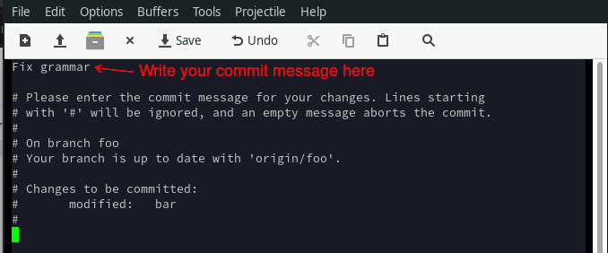
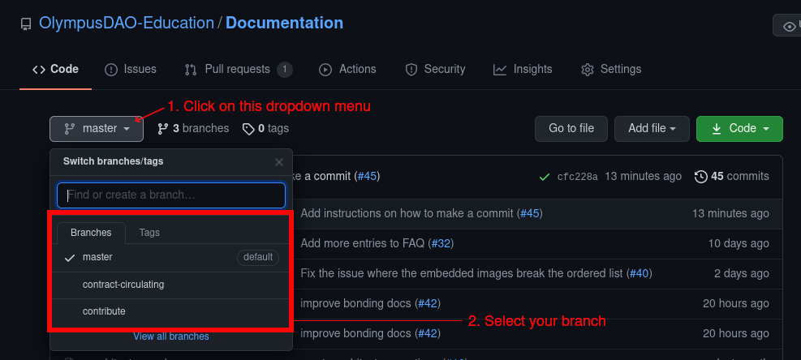
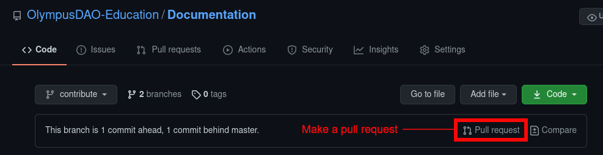
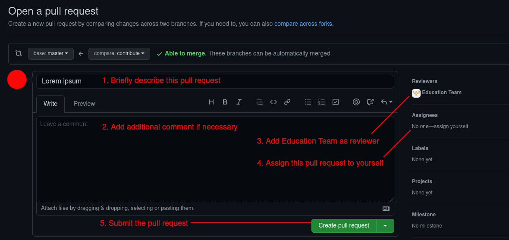
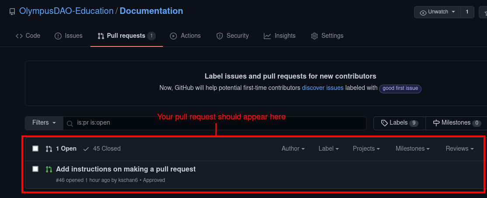
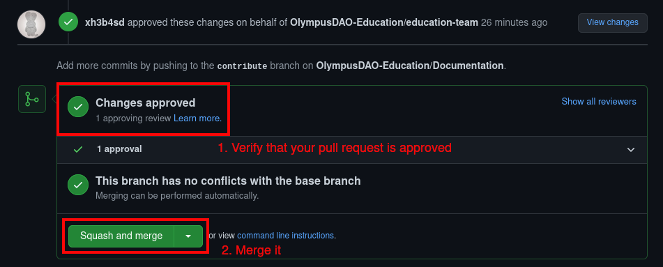
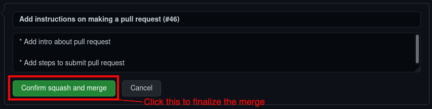

# Contribute to This Document

OlympusDAO operates autonomously, so everyone is welcome to contribute to this GitBook guide. This page outlines the contribution workflow.

## Join Our Community

Join our [DAO Discord](https://discord.gg/42xFV68uEf) and make sure you fill up the onboarding form there. Signal your interest in content creation and you will be assigned a corresponding role. After that, you can collaborate with other members in the Content team to further improve this document.

*Note: The onboarding process might be subject to change in the future. Worry not, just ask around in the discord and our helpful community will guide you through the onboarding process.*

## Contributor Workflow

Prerequisite: Be part of the education team in [our organization](https://github.com/OlympusDAO-Education). Not sure how? Join our community in [DAO Discord](https://discord.gg/42xFV68uEf) and find out more.

Every contributor should follow this workflow when updating the documentation. At a high level, the workflow is as follows:

1. Clone the GitHub repository onto your local machine.
2. Create a local development branch.
3. Push your branch to the repository.
4. Perform your work in the local branch.
5. Commit your changes and push them to the remote branch regularly as your work progresses.
6. When the development is complete, submit a pull request on Github.

If you are not familiar with GitHub, check out [this guide from GitHub](https://guides.github.com/activities/hello-world/).

### First-Time Setup

1. Clone [OlympusDAO-Education/Documentation](https://github.com/OlympusDAO-Education/Documentation) GitHub repository.

    `git clone git@github.com:OlympusDAO-Education/Documentation.git`

2. Go to the project directory where you have cloned the repository and issue this command:

    `git status`

3. You should see the following output in your terminal:

    > On branch master
    >
    > Your branch is up to date with 'origin/master'.
    >
    > nothing to commit, working tree clean

4. You have now successfully cloned the GitHub repository and you can start making changes locally.

### Create a Branch

After you have cloned the repository, you can start making changes to the documentation. All changes should be done in a separate branch before they can be merged to the master branch (i.e. become official).

1. Go to the `master` branch and synchronize it with the repository.

        git checkout master
        git pull

2. Create a branch to work on your changes. We name it `foo` in this example.

        git checkout -b foo

3. Push your branch to the repository so that other members can collaborate with you on the same branch.

        git push -u origin HEAD

4. To verify you have set up your branch correctly, check your working tree status:

        git status

5. The expected output should be:

    > On branch foo
    >
    > Your branch is up to date with 'origin/foo'.
    >
    > nothing to commit, working tree clean

6. You can start editing files now and we will show you how to commit your changes in the next section.

### Commit Changes

Everytime you make a change in the documentation, you can commit the change so that it is recorded by Git. You should also push the change to the repository so that other members can see what you have changed, and most importantly, the repository serves as a backup for your work.

1. Say you have made some changes to the file `bar` and you want to commit it. First you need to add it to the staging area:

        git add bar

2. Check your working tree status:

        git status

3. The expected output should be:

    > On branch foo
    >
    > Your branch is up to date with 'origin/foo'.
    >
    > Changes to be committed:
    >
    > (use "git restore --staged <file>..." to unstage)
    >
    > modified: bar

4. Once the modified file is in the staging area, you can commit it:

        git commit

5. This should open your default editor. Write a message that briefly explains your changes and consummate the commit by saving and exiting the file.

    

6. Finally, you can push your commit to the repository by issuing:

        git push

### Make a Pull Request

When you are satisfied with your modification, you can submit a pull request in order to make it official.

1. Go to [OlympusDAO documentation GitHub repository](https://github.com/OlympusDAO-Education/Documentation).

2. Select the branch that you are working on.

    

3. After selecting your branch, click on the "Pull request" button to make a pull request.

    

4. On the pull request page, briefly describe what your modification is about.

5. Add Education Team as reviewer so that all members of the Education Team will be notified about this pull request.

6. Lastly, assign this pull request to yourself and submit it.

    

### Merge Your Changes

After your pull request is approved by the Education Team, you can merge your changes to the master branch. This will make your modification official.

1. Go to the [Pull Request section](https://github.com/OlympusDAO-Education/Documentation/pulls) and select your pull request.

    

2. Click "Squash and merge" after your pull request has been approved by the Education Team.

    

3. Click "Confirm squash and merge" to finally merge your changes into the master branch.

    
