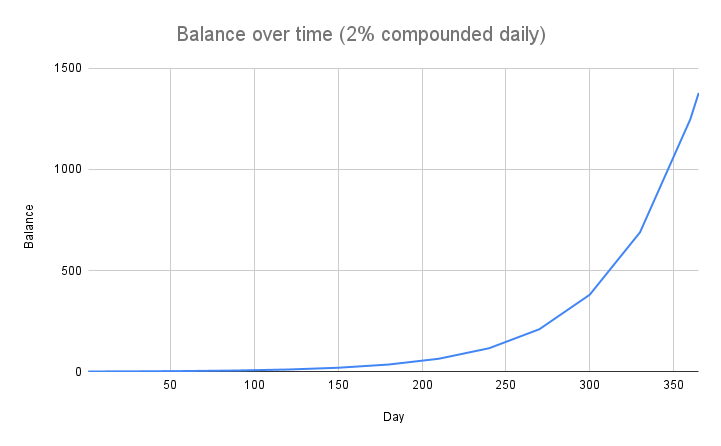

# FAQs

### Why do we need OlympusDAO in the first place?

Dollar-pegged stablecoins have become an essential part of crypto due to their lack of volatility as compared to tokens such as Bitcoin and Ether. Users are comfortable with transacting using stablecoins knowing that they hold the same amount of purchasing power today vs. tomorrow. But this is a fallacy. The dollar is controlled by the US government and the Federal Reserve. This means a depreciation of dollar also means a depreciation of these stablecoins.

OlympusDAO aims to solve this by creating a non-pegged stablecoin called OHM. By focusing on supply growth rather than price appreciation, OlympusDAO hopes that OHM can function as a currency that is able to hold its purchasing power regardless of market volatility.

### OHM is backed, not pegged.

Each OHM is backed by 1 DAI, not pegged to it. Because the treasury backs every OHM with at least 1 DAI, the protocol would buy back and burn OHM when it trades below 1 DAI. This has the effect of pushing OHM price back up to 1 DAI. OHM could always trade above 1 DAI because there is no upper limit imposed by the protocol. Think pegged == 1, while backed >= 1.

You might say that the OHM floor price or intrinsic value is 1 DAI. We believe that the actual price will always be 1 DAI + premium, but in the end that is up to the market to decide.

### How does it work?

At a high level, OlympusDAO consists of its protocol managed treasury, protocol owned liquidity, bond mechanism, and high staking rewards that are designed to control supply expansion.

Bond generates profit for the protocol, and the treasury uses the profit to mint OHM and distribute them to stakers. With LP bond, the protocol is able to accumulate liquidity to ensure the system stability.

### What is the deal with (3,3) and (1,1)?

(3,3) is the idea that, if everyone cooperated in Olympus, it would generate the greatest gain for everyone (from a [game theory](https://en.wikipedia.org/wiki/Game_theory) standpoint). Currently, there are three actions a user can take:

- Staking (+2)
- Bonding (+1)
- Selling (-2)

Staking and bonding are considered beneficiary to the protocol, while selling is considered detrimental. Staking and selling will also cause a price move, while bonding does not (we consider buying OHM from the market as a prerequisite of staking, thus causing a price move). If both actions are beneficiary, the actor who moves price also gets half of the benefit (+1). If both actions are contradictory, the bad actor who moves price gets half of the benefit (+1), while the good actor who moves price gets half of the downside (-1). If both actions are detrimental, which implies both actors are selling, they both get half of the downside (-1).

Thus, given two actors, all scenarios of what they could do and the effect on the protocol are shown here:

- If we both stake (3, 3), it is the best thing for both of us and the protocol (3 + 3 = 6).
- If one of us stakes and the other one bonds, it is also great because staking takes OHM off the market and put it into the protocol, while bonding provides liquidity and DAI for the treasury (3 + 1 = 4).
- When one of us sells, it diminishes effort of the other one who stakes or bonds (1 - 1 = 0).
- When we both sell, it creates the worst outcome for both of us and the protocol (-3 - 3 = -6).

### Why is PCV important?

As the protocol controls the funds in its treasury, OHM can only be minted or burned by the protocol. This also guarantees that the protocol can always back 1 OHM with 1 DAI. You can easily define the risk of your investment because you can be confident that the protocol will indefinitely buy OHM below 1 DAI with the treasury assets until no one is left to sell. You can't trust the FED but you can trust the code.

As the protocol accumulates more PCV, more runway is guaranteed for the stakers. This means the stakers can be confident that the current staking APY can be sustained for a longer term because more funds are available in the treasury. 

### Is this a Ponzi scheme?

[This Investopedia page](https://www.investopedia.com/terms/p/ponzischeme.asp) defines a Ponzi scheme as a fraudulent investing scam promising high rates of return with little risk to investors. This is similar to a pyramid scheme in that both are based on using new investors' funds to pay the earlier backers. Both Ponzi schemes and pyramid schemes eventually bottom out when the flood of new investors dries up and there isn't enough money to go around. At that point, the schemes unravel.

First, OlympusDAO is not fraudulent. The smart contracts that power OlympusDAO are public and can be verified by anyone. The treasury balances are updated in real-time and can be verified in any Ethereum block explorer such as [Etherscan](https://etherscan.io/address/0x886ce997aa9ee4f8c2282e182ab72a705762399d). This ensures transparency and allows the investors to vet the project before making an investment decision.

Second, all speculative financial instruments can only generate holder returns in one of two ways: 1) Grow its net asset value (NAV); 2) Achieve price appreciation such that later investors will buy from early investors at a premium. If you think a company or a token is only worth the amount of cash it has, then Tesla is a Ponzi, as its market cap-to-cash ratio is a whopping 37:1 (as of Q1 2021) and does not generate a penny of dividend to shareholders. The Bitcoin protocol has a market cap-to-cash ratio of infinity as it does not hold a single USD, nor does it generate income not denominated in bitcoin.

Third, OlympusDAO is not a piggy bank whose sole source of income is new infusions of cash. In fact, OHM has a compelling value proposition - it aims to become a crypto stable currency that is backed by real crypto assets in its own treasury (DAI, LP token, etc. as decided by the DAO). Currently, OHM has an intrinsic floor of 1 DAI per 1 OHM, but that's not its market price just as Tesla is worth more than the amount of cash it holds.

Lastly, in OHM's growth and expansion phase, the premium of market value over its intrinsic value will be high as the Protocol builds up its treasury. The buyers are likely to price in the NAV and a premium of future dividend expectations. In OHM's mature and stability phase, the Protocol will convert OHM price volatility to supply volatility. This is achieved by conducting open market operations from its treasury to maintain the price of OHM at a market equilibrium price. The premium of OHM will then necessarily shrink. However, OHM stakers will be protected as their balance will rebase accordingly to maintain their purchasing power. So, unlike a Ponzi scheme where profits only come from the late entrants, the Protocol actually employs strategies to preserve an investor's capital.

### Why is the market price of OHM so volatile?

It is extremely important to understand how early in development the OlympusDAO protocol is. A large amount of discussion has centered around the current price and expected a stable value moving forward. The reality is that these characteristics are not yet determined. The network is currently tuned for expansion of OHM supply, which when paired with the staking, bonding, and yield mechanics of OlympusDAO, result in a fair amount of volatility.

OHM could trade at a very high price because the market is ready to pay a hefty premium to capture a percentage of the current market capitalization. However, the price of OHM could also drop to a large degree if the market sentiment turns bearish. We would expect significant price volatility during our growth phase so please **do your own research** whether this project suits your goals.

### What is the point of buying it now when OHM trades at a very high premium?

When you buy and stake OHM, you capture a percentage of the supply (market cap) which will remain close to a constant. This is because your staked OHM balance also increases along with the circulating supply. The implication is that if you buy OHM when the market cap is low, you would be capturing a larger percentage of the market cap.

### What is a rebase?

Rebase is a mechanism by which your staked OHM balance increases automatically. When new OHM are minted by the protocol, a large portion of it goes to the stakers. Because stakers only see staked OHM balance instead of OHM, the protocol utilizes the rebase mechanism to increase the staked OHM balance so that 1 staked OHM is always redeemable for 1 OHM.

### What is APY?

APY stands for annual percentage yield. It measures the real rate of return on your principal by taking into account the effect of compounding interest. In the case of OlympusDAO, your staked OHM represents your principal, and the compound interest is added periodically on every epoch (2200 Ethereum blocks, or around 8 hours) thanks to the rebase mechanism.

One interesting fact about APY is that your balance will grow not linearly but exponentially over time! Assuming a daily compound interest of 2%, if you start with a balance of 1 OHM on day 1, after a year, your balance will grow to about 1377. That is a lot!

   

### How is the APY calculated?

The APY is calculated from the rebase rate using the following equation:

$$
APY = ( 1 + rebaseRate )^{1095}
$$

It raises to the power of 1095 because a rebase happens 3 times daily. Consider there are 365 days in a year, this would give a rebase frequency of 365 * 3 = 1095.

Rebase rate is determined by the following equation:

$$
rebaseRate = OHM_{distributed} / OHM_{totalStaked}
$$

The number of OHM distributed to the staking contract is calculated from OHM circulating supply using the following equation:

$$
OHM_{distributed} = OHM_{circulating} \times 0.57\%
$$

Note that the 0.57% part is subject to change by the protocol.

### Why does the price of OHM become irrelevant in long term?

As illustrated above, your OHM balance will grow exponentially over time thanks to the power of compounding. Let's say you buy an OHM for $400 now and the market decides that in 1 year time, the intrinsic value of OHM will be $2. Assuming a daily compound interest rate of 2%, your balance would grow to about 1377 OHMs by the end of the year, which is worth around $2754. That is a cool $2354 profit! By now, you should understand that you are paying a premium for OHM now in exchange for a long-term benefit. Thus, you should have a long time horizon to allow your OHM balance to grow exponentially and make this a worthwhile investment.

### What will be OHM's intrinsic value in the future?

There is no clear answer for this, but the intrinsic value can be determined by the treasury performance. For example, if the treasury could guarantee to back every OHM with 100 DAI, the intrinsic value will be 100 DAI. It can also be decided by the DAO. For example, if the DAO decides to [raise the price floor of OHM](https://forum.olympusdao.finance/d/31-use-price-floor-as-tool-for-monetary-policy), its intrinsic value will rise accordingly.

### How does the protocol manage to maintain the high staking APY?

Let’s say the protocol targets an APY of 100,000%. This would translate to a rebase rate of about 0.6328%, or a daily growth of about 2%. Please refer to the equation above to learn [how APY is calculated from the rebase rate](#how-is-the-apy-calculated).

If there are 100,000 of OHM staked right now, the protocol would need to mint an additional 2000 OHM to achieve this daily growth. This is achievable if the protocol can bring in at least 2000 DAI daily from bond sales. If the protocol fails to achieve this, the APY of 100,000% cannot be guaranteed.

### Do I have to unstake and stake OHM on every epoch to get my rebase rewards?

No. Once you have staked OHM with OlympusDAO, your staked OHM balance will auto-compound on every epoch. That increase in balance represents your rebase rewards.
### How do I track my rebase rewards?

You can track your rebase rewards by calculating the increase in your staked OHM balance.

1. Record down the Current Index value on the [staking page](https://app.olympusdao.finance/#/) when you first stake your OHM. Let's call this the Start Index.

    

2. After staking for some time, if you want to determine by how much your balance has increased, check the Current Index value again. Let's call this the End Index.

    

3. By dividing the End Index by Start Index, you would get the ratio by which your staked OHM balance has increased.

    $$
    ratio = endIndex / startIndex
    $$
