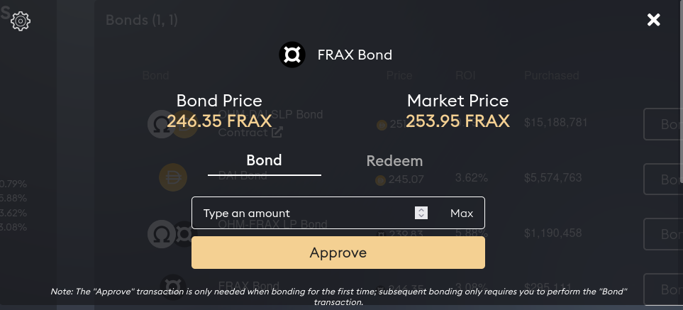

# Bonds

Users can buy OHM from OlympusDAO at a discount in exchange for OHM-FRAX LP tokens. The bond takes roughly 15 epochs to vest, and OHM tokens are vested linearly to the user over that period. LP bonds help OlympusDAO to accumulate and lock liquidity,

## How to Bond

#### LP Bond

1. Go to Uniswap and add liquidity for the [OHM-FRAX pool](https://v2.info.uniswap.org/pair/0x2dce0dda1c2f98e0f171de8333c3c6fe1bbf4877).

2. Head to the [OHM-FRAX LP Bond page of the Olympus website](https://app.olympusdao.finance/#/bonds/ohm_frax_lp). There are two tabs: "Bond" and "Redeem". Make sure "Bond" is selected.

3. Type in the amount of LP tokens you would like to bond, or click "Max" to select the full available amount. Click "Approve" and sign the transaction.

4. After the "Approve" transaction has been processed successfully, click "Bond" and sign the transaction. Voila, you have purchased your first LP bond!

#### FRAX Bond

1. Head to the [FRAX Bond page of the Olympus website](https://app.olympusdao.finance/#/bonds/frax). There are two tabs: "Bond" and "Redeem". Make sure "Bond" is selected.

    

2. Type in the amount of FRAX you would like to bond, then click "Approve" and sign the transaction.

3. After the "Approve" transaction has been processed successfully, click "Bond" and sign the transaction. Voila, you have purchased your first FRAX bond!

*Note: The "Approve" transaction is only needed when bonding for the first time; subsequent bonding only requires you to perform the "Bond" transaction.*
