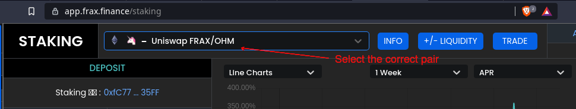

# Stake OHM-FRAX LP Tokens

A new partnership between OlympusDAO and [Frax Finance](https://frax.finance/) allows users to stake OHM-FRAX LP tokens to earn OHM and FXS rewards.

## How to Stake LP Tokens

1. Go to Uniswap and add liquidity for the [OHM-FRAX pool](https://v2.info.uniswap.org/pair/0x2dce0dda1c2f98e0f171de8333c3c6fe1bbf4877).

2. Go to [Frax Finance staking page](https://app.frax.finance/staking) and select the Uniswap FRAX/OHM pair.

    

3. Type in the amount of LP tokens you would like to stake, then click "STAKE".

4. If this is the first time you stake your LP tokens, you would need to approve the website to spend your LP tokens.

5. After the token approval transaction has been processed successfully, you would need to sign another transaction that actually stakes your LP tokens.

6. Read more about staking in [this documentation from Frax Finance](https://docs.frax.finance/v/en/staking).
