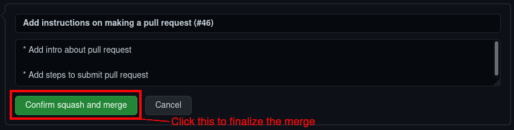

# Contribuer

OlympusDAO fonctionne de manière autonome, donc tout le monde est le bienvenu pour contribuer à ce guide GitBook. Cette page décrit le processus de contribution.

## Rejoignez la communauté

Rejoignez [DAO Discord](https://discord.gg/42xFV68uEf) et veillez à y remplir le formulaire d'accueil. Signalez votre intérêt pour la création de contenu et un rôle correspondant vous sera attribué. Ensuite, vous pourrez collaborer avec d'autres membres de l'équipe "Contenu" pour améliorer encore ce document.   



Le processus d'intégration peut être modifié à l'avenir. Ne vous inquiétez pas, il suffit de demander dans le discord et notre communauté serviable vous guidera.


## Contributor Workflow

Pré-requis : Faites partie de l'équipe chargée de l'éducation dans notre[ organisation](https://github.com/OlympusDAO-Education). Vous ne savez pas comment faire ? Rejoignez notre communauté sur DAO Discord [DAO Discord](https://discord.gg/42xFV68uEf) et découvrez-en plus.

Chaque contributeur doit suivre ce flux de travail lors de la mise à jour de la documentation. De manière générale, le flux de travail est le suivant :

1. Clonez le dépôt GitHub sur votre machine locale.
2. Créez une "branch" de développement locale.
3. Ajouter la au répertoire
4. Réalisez votre travail en local.
5. Validez vos changements et ajoutez les à votre "remote branch" au fur et à mesure de l'avancement de votre travail.
6. Lorsque le développement est terminé, soumettez une demande de retrait sur Github.

Si vous n'êtes pas familier avec GitHub, consultez ce guide de [GitHub](https://guides.github.com/activities/hello-world/) \(anglais\)

### First-Time Setup

1. Clonez le répertoire GitHub [OlympusDAO-Education/Documentation](https://github.com/OlympusDAO-Education/Documentation).

   `git clone git@github.com:OlympusDAO-Education/Documentation.git`

2. Allez dans le répertoire du projet où vous avez cloné le référentiel et lancez cette commande :

   `git status`

3. Vous devriez voir la sortie suivante dans votre terminal :

   > On branch master
   >
   > Your branch is up to date with 'origin/master'.
   >
   > nothing to commit, working tree clean

4. Vous avez maintenant cloné avec succès le répertoire GitHub et vous pouvez commencer à apporter des modifications localement.

### Créer une branche \("branch"\)

Après avoir cloné le répertoire, vous pouvez commencer à apporter des modifications à la documentation. Toutes les modifications doivent être effectuées dans une branche séparée avant de pouvoir être fusionnées avec la branche principale \(c'est-à-dire devenir officielles\).

1. Allez à la `master` branch et synchronisez avec le répertoire.

   ```text
    git checkout master
    git pull
   ```

2. Créez une "branch" pour travailler sur vos modifications. Nous la nommons foo dans cet exemple.

   ```text
    git checkout -b foo
   ```

3. Transférer votre branche dans le répertoire afin que les autres membres puissent collaborer avec vous sur la même branche.

   ```text
    git push -u origin HEAD
   ```

4. Pour vérifier que vous avez configuré votre branche correctement, vérifiez le statut de votre arbre de travail :

   ```text
    git status
   ```

5. Le résultat attendu devrait être :

   > On branch foo
   >
   > Your branch is up to date with 'origin/foo'.
   >
   > nothing to commit, working tree clean

6. Vous pouvez commencer à modifier les fichiers maintenant et nous vous montrerons comment valider vos modifications dans la section suivante.

### Livrer les changements

Chaque fois que vous apportez une modification à la documentation, vous pouvez valider la modification afin qu'elle soit enregistrée par Git. Vous devez également transférer la modification vers le dépôt afin que les autres membres puissent voir ce que vous avez modifié et, surtout, le répertoire sert de sauvegarde pour votre travail.

1. Disons que vous avez apporté des modifications au fichier `bar` et vous voulez le valider. D'abord, vous devez l'ajouter à la zone de transit :

   ```text
    git add bar
   ```

2. Vérifiez le statut de votre arbre de travail :

   ```text
    git status
   ```

3. Le résultat attendu devrait être :

   > On branch foo
   >
   > Your branch is up to date with 'origin/foo'.
   >
   > Changes to be committed:
   >
   > \(use "git restore --staged ..." to unstage\)
   >
   > modified: bar

4. Une fois que le fichier modifié est dans "staging area", vous pouvez l'ajouter :

   ```text
    git commit
   ```

5. Cela devrait ouvrir votre éditeur par défaut. Écrivez un message qui explique brièvement vos changements et terminez la validation en enregistrant et en quittant le fichier.

   

6. Finally, you can push your commit to the repository by issuing:

   ```text
    git push
   ```

### Emettre une requête d'ajout

Lorsque vous êtes satisfait de votre modification, vous pouvez soumettre une demande de retrait afin de la rendre officielle.

1. Aller sur [OlympusDAO documentation GitHub repository](https://github.com/OlympusDAO-Education/Documentation).
2. Sélectionnez la branche sur laquelle vous travaillez.

   

3. Après avoir sélectionné votre branche, cliquez sur le bouton "Pull request" pour faire une demande de modification.

   

4. Sur la page "pull request", décrivez brièvement l'objet de votre modification.
5. Ajouter l'Équipe Éducation en tant que réviseur afin que tous les membres de l'équipe Éducation soient informés de cette demande de modification.
6. Enfin, attribuez cette demande de modification à vous-même et soumettez-la.

   

### Merge vos changements

Une fois que votre demande de modification a été approuvée par l'équipe chargée de l'éducation, vous pouvez fusionner vos modifications avec la branche master. Cela rendra votre modification officielle.

1. Allez sur [Pull Request section](https://github.com/OlympusDAO-Education/Documentation/pulls) et sélectionnez votre demande.  


     

2. Cliquez sur "Squash and merge" une fois que votre demande à été approuvé par l'Education Team.  


     

3. Cliquez "Confirm squash and merge" pour finalisez la fusion avec la branche maître.  


   

