# Grant Decision Process

Olympus Grants aims to educate the community, increase Olympus infrastructure and to build OHM utility. Each Grant applicant must go through a rigorous vetting process to determine whether it is a viable opportunity.

The diagram below illustrates the decision-making process for approving grants.

