# Policy Decision Process

OlympusDAO’s Policy team monitors the protocol through key metrics related to bonds, liquidity, treasury and key partnerships. An internal process is implemented for every decision.

The diagram below illustrates the decision-making process for amending/creating policies.

