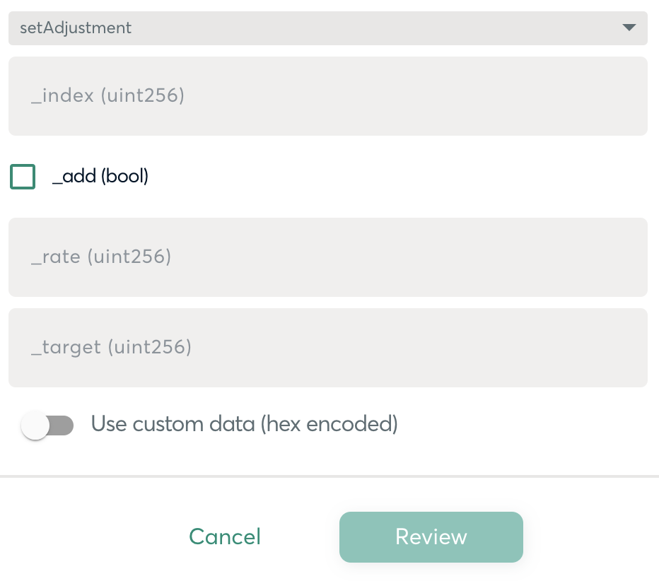

# Getting Started

## Supplying Information to OlympusDAO

First, OlympusDAO needs to know how long you would like to run the bond program. We recommend 1-3 months but the decision is up to your team. We require the following information to run a better analysis of your token emissions program:

1. Total pilot emissions \(e.g. 1,000,000 ABC token\).
2. Target emissions per week \(e.g. 333,333 ABC/week\).
3. Assumption of ABC price at the start. We suggest using a 30-day moving average \(30dma\).
4. Assumption of LP token price. Again, a 30dma is recommended.

## Launching the Bond Program

A high-level overview of activities:

1. OlympusDAO will deploy a factory contract.
2. OlympusDAO will use the factory contract to deploy Olympus Pro Custom Treasury and Olympus Pro Custom Bond contracts, with the `owner` set to your multisig address.
3. At this point, you are in full control of the Custom Treasury and Custom Bond contracts.
4. You will call `toggleBondContract` in the Custom Treasury contract and pass in the Custom Bond contract address.
5. You will set the vesting block of the Custom Bond contract by calling `setBondTerms`.
6. You will transfer your payout tokens to the Custom Treasury contract.
7. You will initialize the Custom Bond contract.
8. A policy team member from OlympusDAO will suggest BCV and other relevant parameters to be used. The following section will give you an overview of the adjustments.

## Adjusting Bond Control Variables \(BCV\)

Through a weekly policy meeting with our team, we may suggest changes to the [BCV](https://docs.olympusdao.finance/references/glossary#bcv) parameter that controls the bond capacity. For example, a higher BCV value translates to a higher bond price, which has an effect of reducing the bond capacity.

To adjust the BCV, call `setAdjustment` function and pass in the appropriate arguments \(dummy values are used in this example\):

```text
setAdjustment
    _index(uint256):4
    _add(bool):False
    _rate(uint256):2
    _target(uint256):2968
```

In Gnosis, the transaction builder will look like this:



## Adding New Bond Types

When adding new bond types there are two options:

1. Create a new Custom Bond contract and use the existing treasury. This will only work if the same payout token is used.
2. Create another set of Custom Bond and Custom Treasury contracts.

If you decide to go with option 1, it is as simple as calling `toggleBondContract` from the Custom Treasury contract and passing in the new Custom Bond contract address. As before, the bond will have to be initialized. An OlympusDAO policy member will assist in this as well.

For option 2, you will just follow the steps as outlined in [Launching the Bond Program](getting-started.md#launching-the-bond-program) section.

