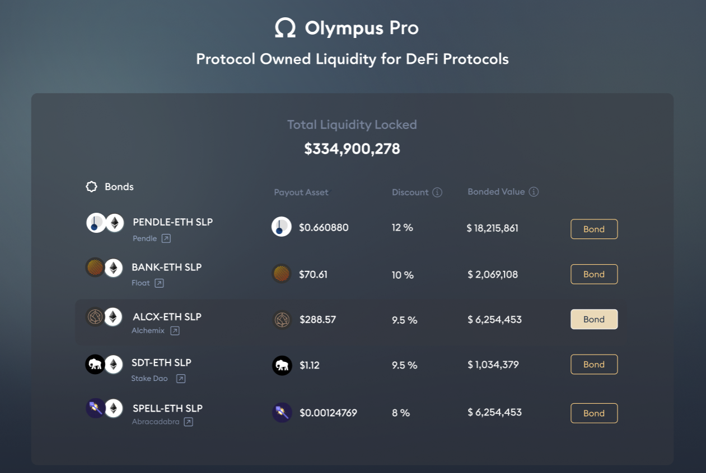
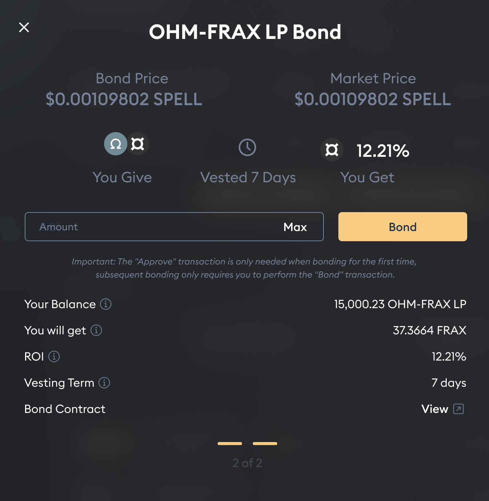
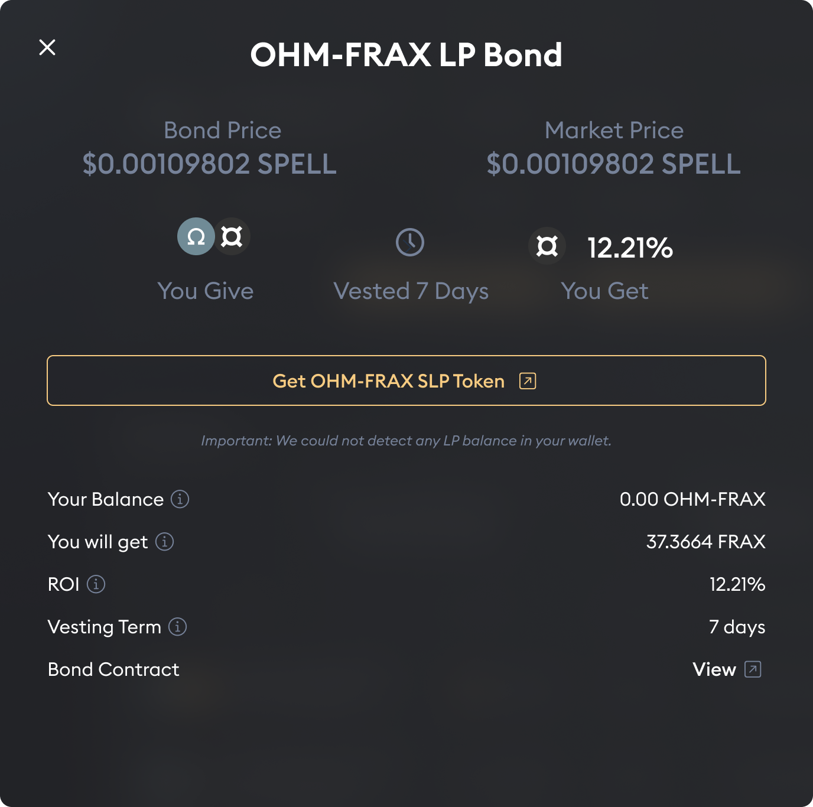
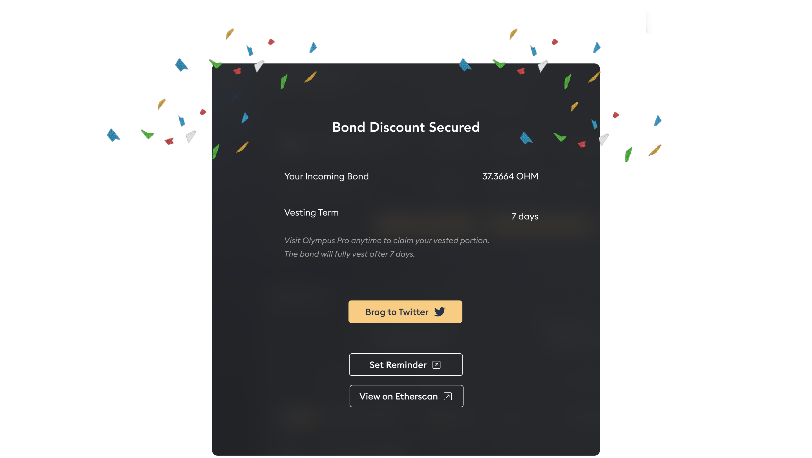

# Bond Marketplace Guide

The Bond Marketplace is the heart of Olympus Pro. It provides the user with a suite of different bonds they can purchase from: 

### How to Bond

1. After choosing a bond from the marketplace, you will be greeted with the bond page below. Make sure to connect your wallet first: 

2. After your wallet is connected, enter the amount of LP tokens that you would like to supply. You will be quoted an equivalent amount of the payout token in the "You will get" field:

3. If you don't have the required LP token, you can click the link provided to acquire them:

4. There is also a Zap Pro feature that allows you to obtain LP tokens in a single transaction:

5. If this is your first bond purchase, you need to approve the bond contract to spend your token first. Then, you need to sign another transaction to actually purchase the bond:

6. Once the bond transaction is confirmed, you have successfully purchased a bond!  


The "Approve" transaction is only needed when you purchase a bond for the first time; subsequent purchase of the same bond only requires you to perform the "Bond" transaction.


