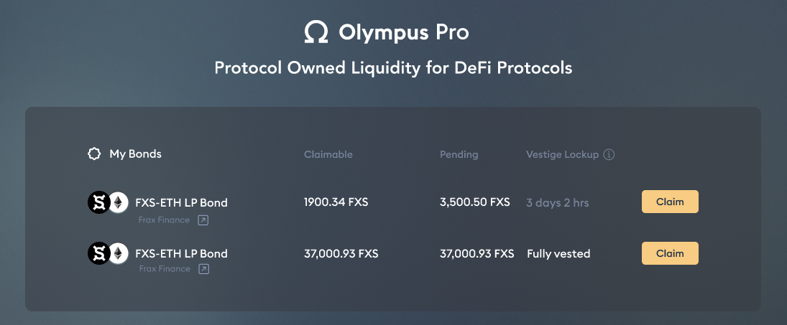
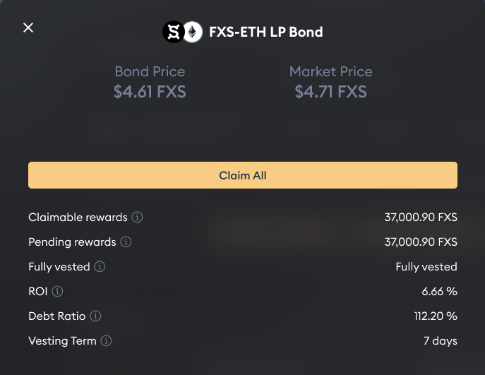
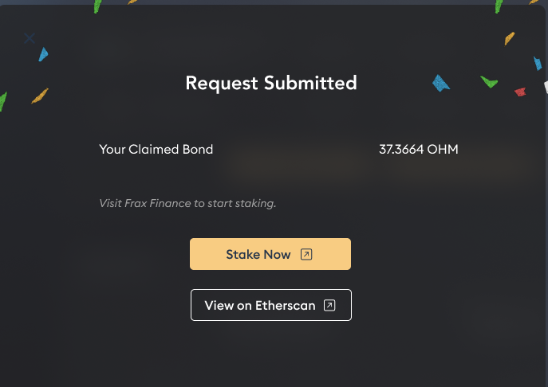

# Claim Rewards

1. If you have purchased a bond from the Marketplace before, your dashboard will show you the currently vesting bond, and those that have fully vested:

2. Select the bond that is still vesting and click "Claim". A claim modal should show up:

3. Click "Claim All" to claim the bond rewards. When the transaction is confirmed, the claimed rewards should go to your wallet.

4. Additionally, if the protocol supports staking of its reward tokens, you can click "Stake Now" which will direct you to the protocol's staking pool.

