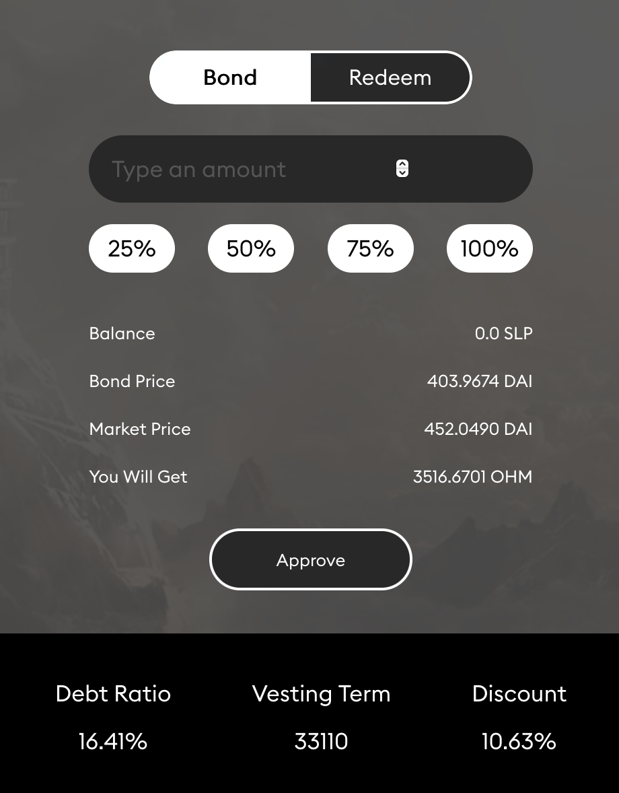
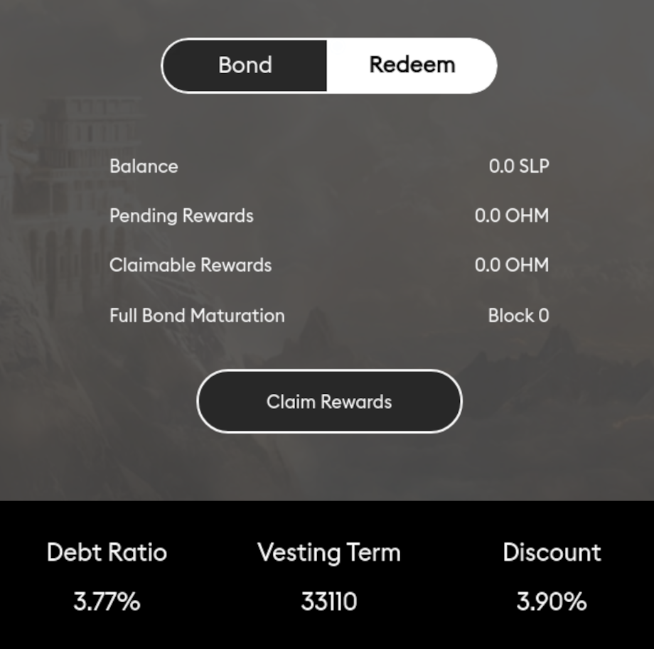

# Bonds

Bonds allow users to buy OHM from the protocol at a discount by trading it with i) liquidity \(LP tokens\) or ii) DAI. Bonds take roughly 15 epochs to vest, and OHM tokens are vested linearly to the user over that period. LP bonds help the protocol to accumulate and lock liquidity, while DAI bonds allow the protocol to grow its treasury, and thus its RFV faster.

## How to Bond

#### LP Bond

1. Go to Sushiswap and add liquidity. If you do not know how to do so, there is a good guide on [SushiSwap documentation](https://help.sushidocs.com/guides/how-to-add-tokens-to-sushiswap-exchange-as-an-lp).

2. Head to the [Bond page of the Olympus website](http://olympusdao.finance/#/bond). There are two tabs: "Bond" and "Redeem". Make sure "Bond" is selected.

3. Type in the amount of SLP you would like to bond, then click "Approve" and sign the transaction.

4. After the "Approve" transaction has been processed successfully, click "Bond" and sign the transaction. Voila, you have purchased your first SLP bond!

#### DAI Bond

1. Head to the [DAI Bond page of the Olympus website](http://olympusdao.finance/#/bondai). There are two tabs: "Bond" and "Redeem". Make sure "Bond" is selected.

2. Type in the amount of DAI you would like to bond, then click "Approve" and sign the transaction.

3. After the "Approve" transaction has been processed successfully, click "Bond" and sign the transaction. Voila, you have purchased your first DAI bond!

*Note: The "Approve" transaction is only needed when bonding for the first time; subsequent bonding only requires you to perform the "Bond" transaction.*

## **How to Redeem**

On the same webpage that you used to purchase bond, select the "Redeem" tab. Click "Redeem" to claim all of your available rewards.

## Reading the Info

**Balance** is your balance of SLP tokens. This is the asset used to create a bond.

**Bond Price** is the price of OHM you get from bonding. You can calculate the bond price using the following formulae:

- SLP Bond: \(Value of your SLP token / OHM you'll get from bonding\)
- DAI Bond: \(Value of your DAI token / OHM you'll get from bonding\)

**Market Price** is the market price of OHM.

**You Will Get** tells you how many OHM you will get from bonding the chosen amount of SLP or DAI tokens.

**Debt Ratio** measures the total amount of OHM created from bonds that have yet to pay out. The debt ratio is calculated differently for SLP bond and DAI bond:

- SLP Bond: \(OHM created from unredeemed bonds / OHM total supply\)
- DAI Bond: \(OHM created from unredeemed bonds / OHM circulating supply\)

**Vesting Term** measures the period a bond takes to fully redeem. This number is in Ethereum blocks. 33110 blocks is approximately 5 days or 15 epochs.

**Discount** is the difference between the bond price and the market price. In the photo above, bonding would give you a 10.63% discount versus buying the same amount of OHM from the market.

**Pending Rewards** is the amount of OHM you are entitled to from bonding.

**Claimable Rewards** is the amount of OHM that you can claim now. This amount keeps on increasing as OHM is vested to you over the bonding period.

**Full Bond Maturation** refers to the Ethereum block when the bond matures.
