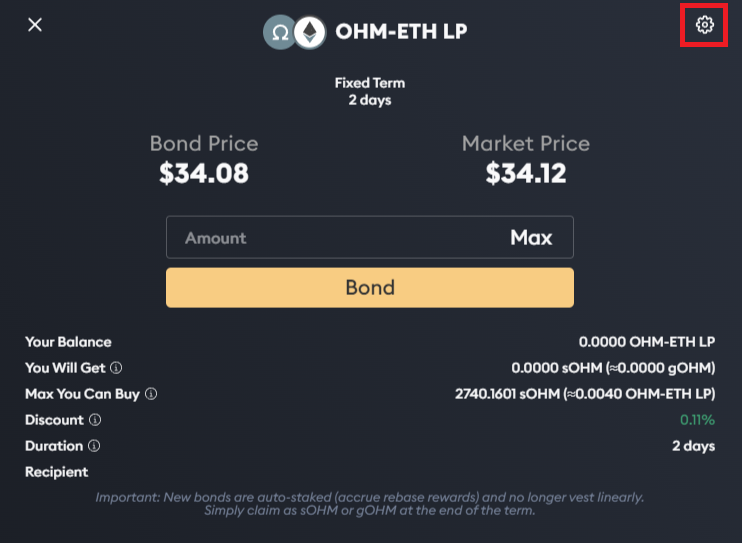
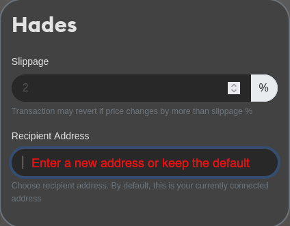
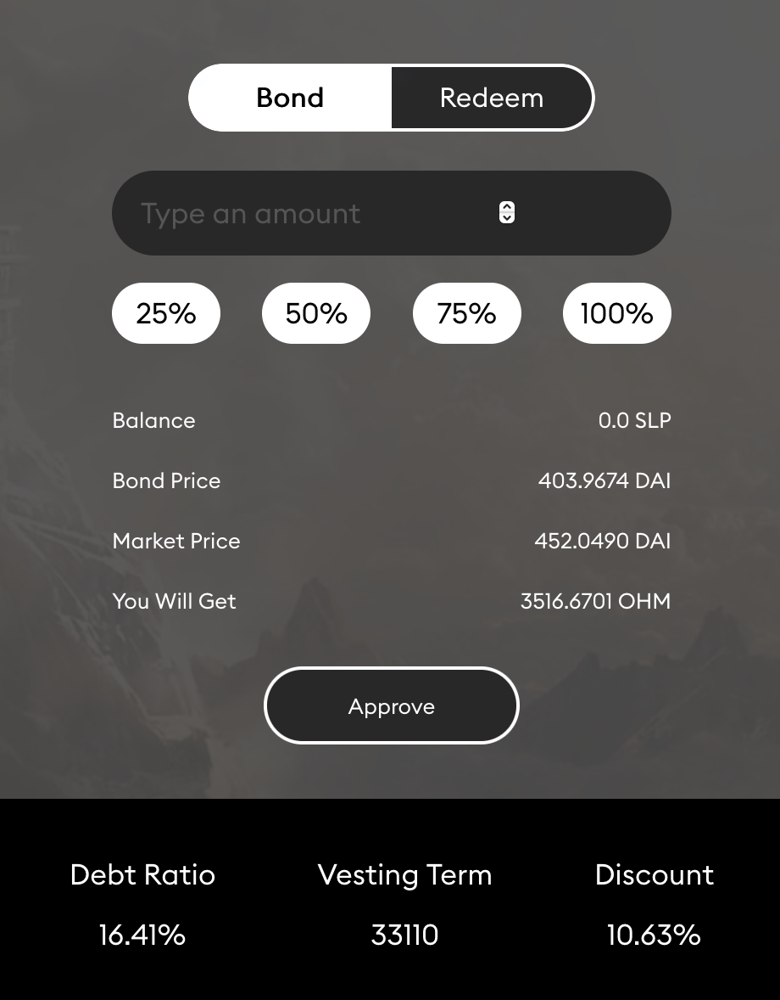

# Purchase A Bond \(1, 1\)

Bonds allow users to buy OHM from the protocol at a discount by trading it with i\) liquidity \(LP tokens\) or ii\) other assets. The former is called [liquidity bonds](https://docs.olympusdao.finance/references/glossary#liquidity-bonds) and the latter [reserve bonds](https://docs.olympusdao.finance/references/glossary#reserve-bonds).

Bonds take roughly 15 epochs to vest, and OHM tokens are vested linearly to the user over that period. Liquidity bonds help the protocol to accumulate and lock liquidity, while reserve bonds allow the protocol to grow its treasury, and thus its RFV faster.

Olympus offers five types of bonds [on its website](https://app.olympusdao.finance/#/bonds):

* [DAI bond](bond_dai.md)
* [FRAX bond](bond_frax.md)
* [wETH bond](bond_weth.md)
* [OHM-DAI LP bond](ohm-dai-lp-bond.md)
* [OHM-FRAX LP bond](bond_ohm_frax.md)

Check out this video on how to get a bond from Olympus:



## Hades

Hades is a feature that allows you to purchase bonds while sending the acquired OHM to another address. This is useful for additional privacy, or for purchasing multiple bonds while the current bonds are still vesting. Note that if the same account holds multiple bonds, the pending rewards from the earlier bonds have to be forfeited.

1. Go to [Bond page](https://app.olympusdao.finance/#/bonds) and select the bond type you want to purchase.
2. Select the amount that you would like to bond, then click on the cogwheel icon at the top right of the page.

   

3. The Hades menu will show up. At the Recipient Address field, you can specify a different address that will receive the vested OHM. By default, it is filled with your current address.

   

4. You can also modify the Slippage field to increase or decrease the likelihood of your order getting through. A higher slippage increases that likelihood, but you may get a more undesirable fill price.
5. Close the Hades menu by clicking the cogwheel icon again.
6. Click "Approve" and sign the transaction.
7. After the "Approve" transaction has been processed successfully, click "Bond" and sign the transaction. Voila, you have purchased your first bond using Hades!

_Notes:_

* _The "Approve" transaction is only needed when bonding for the first time; subsequent bonding only requires you to perform the "Bond" transaction._
* _When using Hades, do not alter the bond amount after you have closed the Hades menu, as it will reset the recipient address._

## **How to Redeem**

Go to [Bond page](https://app.olympusdao.finance/#/bonds) and select the bond type you have purchased. Select the "Redeem" tab. Then, click "Claim Rewards" to claim all of your available rewards.

## Reading the Info

**Balance** is your balance of SLP tokens. This is the asset used to create a bond.

**Bond Price** is the price of OHM you get from bonding. You can calculate the bond price using the following formulae:

* SLP Bond: \(Value of your SLP token / OHM you'll get from bonding\)
* DAI Bond: \(Value of your DAI token / OHM you'll get from bonding\)

**Market Price** is the market price of OHM.

**You Will Get** tells you how many OHM you will get from bonding.

**Debt Ratio** measures the total amount of OHM created from bonds that have yet to be paid out by the protocol. The debt ratio is calculated differently for SLP bond and DAI bond:

* SLP Bond: \(OHM created from unredeemed bonds / OHM total supply\)
* DAI Bond: \(OHM created from unredeemed bonds / OHM circulating supply\)

**Vesting Term** measures the period a bond takes to fully redeem. This number is in Ethereum blocks. 33110 blocks is approximately 5 days or 15 epochs.

**Discount** is the difference between the bond price and the market price. In the screenshot above, bonding would give you a 10.63% discount versus buying the same amount of OHM from the market.

**Pending Rewards** is the amount of OHM you are entitled to receive from bonding.

**Claimable Rewards** is the amount of OHM that you can claim now. This amount keeps increasing as OHM is vested to you over the bonding period.

**Full Bond Maturation** refers to the Ethereum block when the bond is fully redeemable.

