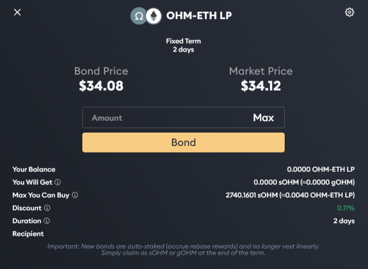

# Purchasing A Bond \(1, 1\)

Bonds allow users to buy OHM from the protocol at a discount by trading it against i\) liquidity \(LP tokens\) or ii\) other assets. 
The former are called [liquidity bonds](https://docs.olympusdao.finance/references/glossary#liquidity-bonds) and the latter [reserve bonds](https://docs.olympusdao.finance/references/glossary#reserve-bonds).

Bonds take a variable amount of time to vest, called the vesting period. 
During this period, the OHM tokens given as payout to the bonder are staked but locked. 
Afterwards, the bonder can claim the OHM in full. 

Liquidity bonds help the protocol to accumulate and lock liquidity, while reserve bonds allow the protocol to grow its treasury.

Olympus offers two types of bonds [on its website](https://app.olympusdao.finance/#/bonds), reserve and liquidity bonds.
You can follow the [tutorial](bond_example.md) to see a step-by-step guide to bonding.

## Settings

Bonds settings can be tweaked to change the slippage or to send the OHM payout to a different address than the one
buying the bond (a feature called Hades), which can be useful for additional privacy. To access these settings:

1. Go to the [Bonds page](https://app.olympusdao.finance/#/bonds) and select the bond type you want to purchase.
2. Click on the cogwheel icon at the top right of the page.

   

3. The settings menu will show up. 

   

4. You can modify the Slippage field to increase or decrease the likelihood of your order getting through. A higher slippage increases that likelihood, but you may get a more undesirable fill price.
5. In the Recipient Address field, you can specify a different address that will receive the vested OHM. By default, it is filled with your current address.

_Notes:_

* _An "Approve" transaction is needed when bonding an asset for the first time; this transaction gives the [Olympus bond contract](../../contracts/bonds.md) the permission to execute the bond. Subsequent bonding only requires you to perform the "Bond" transaction._

## **How to Redeem**

Go to the [Bonds page](https://app.olympusdao.finance/#/bonds).

You can then select whether you want the payout to be in sOHM or in gOHM, and claim all vested bonds in one click 
or claim each bond individually if you prefer.

## Reading the Info

**Balance** is your balance of assets that are required to create a bond.

**Bond Price** is the price of OHM you get from bonding. You can calculate the bond price using the following formulae:

* SLP Bond: \(Value of your SLP token / OHM you'll get from bonding\)
* DAI Bond: \(Value of your DAI token / OHM you'll get from bonding\)

**Market Price** is the market price of OHM.

**You Will Get** tells you how many OHM you will get from bonding, expressed in staked sOHM and gOHM.

**Max You Can Buy** tells you the maximum amout of OHM you can buy through this bond, expressed in staked sOHM and gOHM.

**Discount** is the difference between the bond price and the market price expressed as a percentage. In the screenshot above, bonding would give you a 0.11% discount versus buying the same amount of OHM from the market.

**Duration** gives you the vesting term, which is the period during which the OHM payout is locked.
