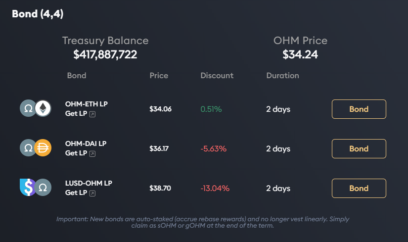
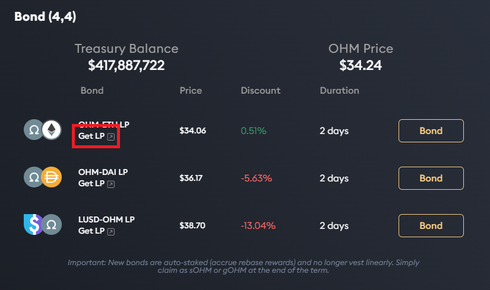
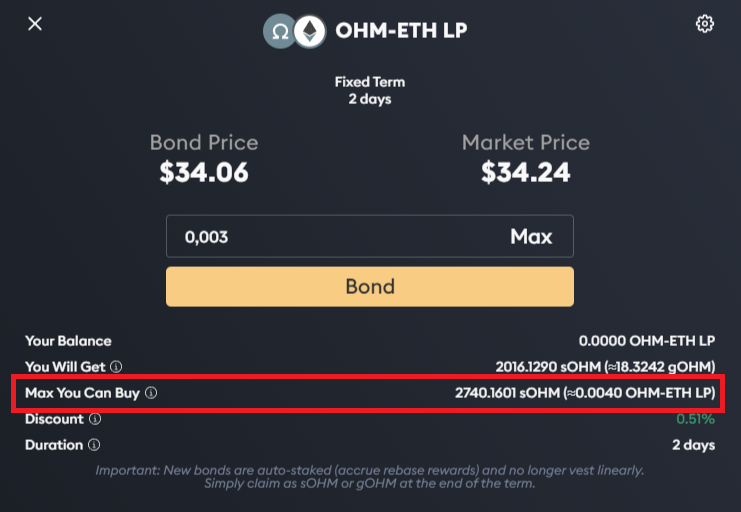

# Example: How to Buy A Bond

This tutorial will be given for an OHM-ETH bond, which is a [liquidity bonds](../references/glossary.md#liquidity-bonds). 
If you want to buy a reserve bond, the steps are simpler: 
Simply buy the reserve asset (skip the steps in [Acquire OHM-wETH LP](#acquire-ohm-weth-lp)) and go directly to 
[buying the bonds](#buy-the-bond).

## Acquire OHM-wETH LP

1. Make sure you have OHM and wETH in equal usd amounts in your wallet. For example, you can [use matcha to swap for wETH](https://matcha.xyz/markets/1/0x64aa3364f17a4d01c6f1751fd97c2bd3d7e7f1d5/0xc02aaa39b223fe8d0a0e5c4f27ead9083c756cc2) if you don't have any.

2. Head to the [bonds page](https://app.olympusdao.finance/#/bonds) of the Olympus website. 

3. Click on the "Get LP" button below the OHM-ETH bond, which will take you to the page to get LP tokens in exchange for OHM and ETH. 

## Buy The Bond

1. Type in the amount of assets you would like to bond, while making sure you are not trying to bond more OHM than is allowed. 
The **Max You Can Buy** field below shows the maximum amount of OHM you can purchase, 
while the **You Will Get** field tells you how many OHM you are purchasing.

2. If this is your first purchase of this type of bond, you need to approve the Olympus contract to spend your tokens. Click "Approve" and sign the transaction.

3. After the approval transaction is successful, the button changes to display "Bond".

4. Click "Bond" and sign the transaction. Voilà, you have purchased your first bond!

