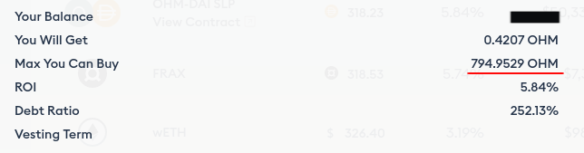

# FRAX Bond

FRAX bond was introduced on 16 June 2021. It allows you to trade [FRAX](https://www.coingecko.com/en/coins/frax) in exchange for discounted OHM on Olympus.

## How to Bond

1. Make sure you have FRAX in your wallet. For example, you can [go to Uniswap to swap for FRAX](https://app.uniswap.org/#/swap?outputCurrency=0x853d955acef822db058eb8505911ed77f175b99e) if you don't have any.

2. Head to the [FRAX Bond page of the Olympus website](https://app.olympusdao.finance/#/bonds/frax). There are two tabs: "Bond" and "Redeem". Make sure "Bond" is selected.

3. Type in the amount of FRAX you would like to bond. Make sure you are not trying to bond more than is allowed. The **Max You Can Buy** field below shows the maximum amount of OHM you can purchase.

4. If this is your first purchase, you need to approve the Olympus contract to spend your FRAX. Click "Approve" and sign the transaction.

5. After the "Approve" transaction has been processed successfully, refresh the page. The "Approve" button should be changed to display "Bond" by now.

6. Click "Bond" and sign the transaction. Voila, you have purchased your first FRAX bond!

