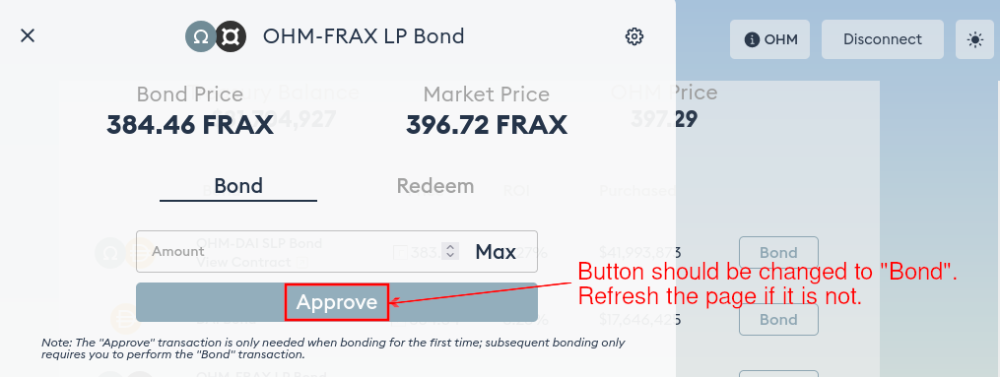

# OHM-WETH LP Bond

OHM-WETH LP bond was introduced on 26th October 2021. It allows you to trade [OHM-WETH LP token](https://app.sushi.com/add/0x383518188c0c6d7730d91b2c03a03c837814a899/0xc02aaa39b223fe8d0a0e5c4f27ead9083c756cc2) in exchange for discounted OHM on Olympus.

## How to Bond

1. Make sure you have OHM-WETH LP tokens in your wallet. You need to go to Sushiswap and add liquidity for the [OHM-WETH pool](https://app.sushi.com/add/0x383518188c0c6d7730d91b2c03a03c837814a899/0xc02aaa39b223fe8d0a0e5c4f27ead9083c756cc2) to acquire them.

2. Head to the [OHM-WETH LP Bond page of the Olympus website](https://app.olympusdao.finance/#/bonds/ohm_weth_lp). There are two tabs: "Bond" and "Redeem". Make sure "Bond" is selected.

3. Type in the amount of OHM-WETH LP tokens you would like to bond. Make sure you are not trying to bond more than is allowed. The **Max You Can Buy** field below shows the maximum amount of OHM you can purchase.

4. If this is your first purchase, you need to approve the Olympus contract to spend your OHM-WETH LP tokens. Click "Approve" and sign the transaction.

5. After the "Approve" transaction has been processed successfully, refresh the page. The "Approve" button should be changed to display "Bond" by now.

6. Click "Bond" and sign the transaction. Voila, you have purchased your first OHM-WETH LP bond!
