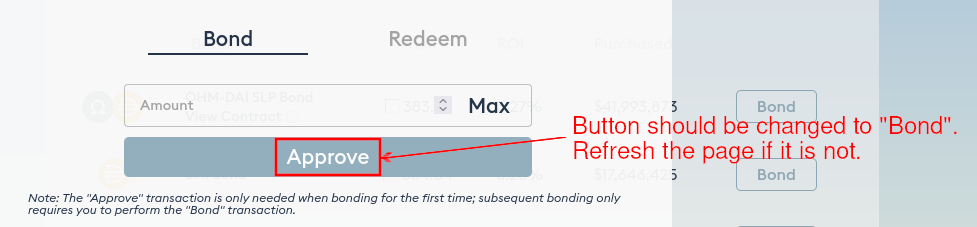

# wETH Bond

wETH bond was introduced on 6 August 2021. It allows you to trade [wETH](https://weth.io/) in exchange for discounted OHM on Olympus.

## How to Bond

1. Make sure you have wETH in your wallet. For example, you can [go to Sushiswap to swap for wETH](https://app.sushi.com/swap?inputCurrency=&outputCurrency=0xC02aaA39b223FE8D0A0e5C4F27eAD9083C756Cc2) if you don't have any.

2. Head to the [wETH Bond page of the Olympus website](https://app.olympusdao.finance/#/bonds/eth). There are two tabs: "Bond" and "Redeem". Make sure "Bond" is selected.

3. Type in the amount of wETH you would like to bond. Make sure you are not trying to bond more than is allowed. The **Max You Can Buy** field below shows the maximum amount of OHM you can purchase.

4. If this is your first purchase, you need to approve the Olympus contract to spend your wETH. Click "Approve" and sign the transaction.

5. After the "Approve" transaction has been processed successfully, refresh the page. The "Approve" button should be changed to display "Bond" by now.

6. Click "Bond" and sign the transaction. Voila, you have purchased your first wETH bond!

