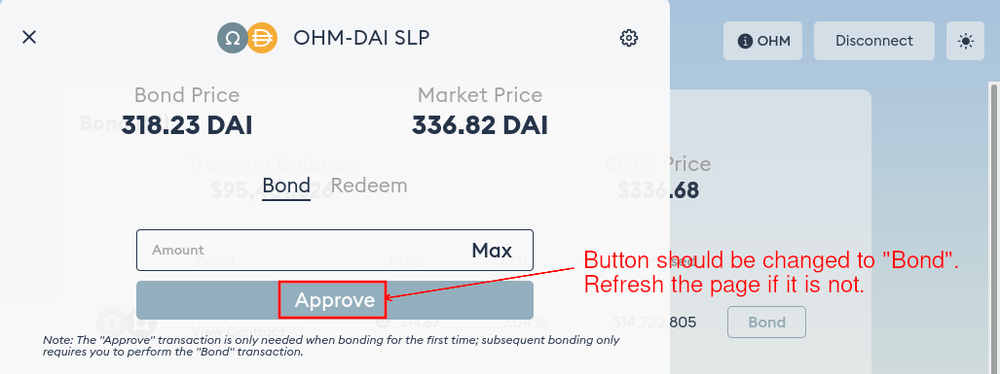

# OHM-DAI LP Bond

OHM-DAI LP bond was introduced on 1 April 2021. It allows you to trade [OHM-DAI SLP token](https://app.sushi.com/add/0x6B175474E89094C44Da98b954EedeAC495271d0F/0x383518188C0C6d7730D91b2c03a03C837814a899) in exchange for discounted OHM on Olympus.

## How to Bond

1. Make sure you have OHM-DAI SLP tokens in your wallet. You need to go to Sushiswap and add liquidity for the [OHM-DAI pool](https://app.sushi.com/add/0x6B175474E89094C44Da98b954EedeAC495271d0F/0x383518188C0C6d7730D91b2c03a03C837814a899) to acquire them.

2. Head to the [OHM-DAI SLP Bond page of the Olympus website](https://app.olympusdao.finance/#/bonds/ohm_dai_lp). There are two tabs: "Bond" and "Redeem". Make sure "Bond" is selected.

3. Type in the amount of OHM-DAI SLP tokens you would like to bond. Make sure you are not trying to bond more than is allowed. The **Max You Can Buy** field below shows the maximum amount of OHM you can purchase.

4. If this is your first purchase, you need to approve the Olympus contract to spend your OHM-DAI SLP tokens. Click "Approve" and sign the transaction.

5. After the "Approve" transaction has been processed successfully, refresh the page. The "Approve" button should be changed to display "Bond" by now.

6. Click "Bond" and sign the transaction. Voila, you have purchased your first OHM-DAI LP bond!

