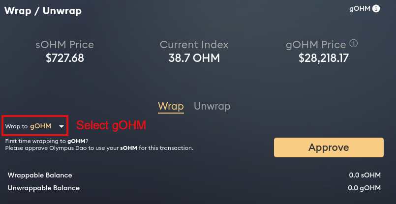
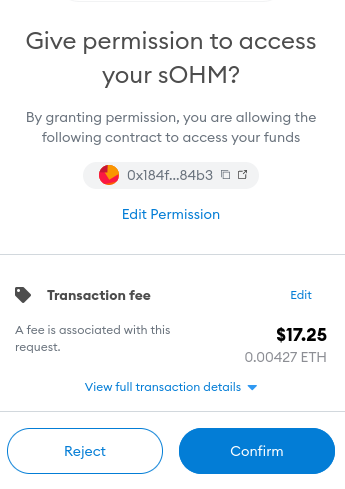
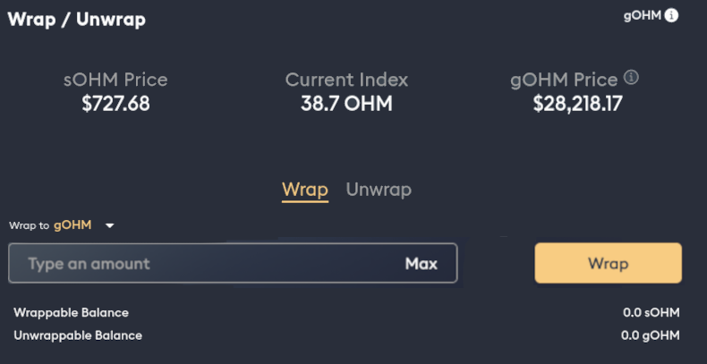

# Migrate Tokens (v2)

To prepare the roll-out of [Olympus v2](https://olympusdao.medium.com/introducing-olympus-v2-c4ade14e9fe),
users need to migrate their v1 OHM tokens to their identical v2 counterparts. You
can learn more about the v2 migration from this [FAQ page](../basics/migration.md).

## How to Migrate sOHM to gOHM

[gOHM](../contracts/tokens.md#gohm) will be the first v2 token to roll out. Users
can wrap their v1 sOHM tokens into gOHM tokens as part of the v2 migration.

1\. Go to the [Wrap section of Olympus App](https://app.olympusdao.finance/#/wrap).
Select gOHM under the drop-down menu.

2\. If this is your first time wrapping sOHM, you need to approve the smart contract
to use your token. Click "Approve" and confirm the transaction on your wallet.

3\. After the approval transaction is confirmed, enter the amount of sOHM that
you wish to wrap. You can also hit "Max" for the full amount. Then, click "Wrap"
and sign the transaction.

4\. When the wrap transaction is confirmed, your gOHM balance will be updated.
Please add the [gOHM token contract](../contracts/tokens.md#gohm) to your wallet
if you can't see it.
