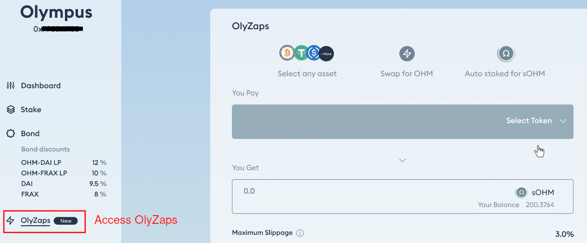
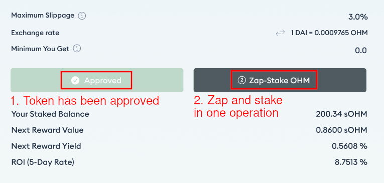

# OlyZaps

OlyZaps allows you to exchange (zap) any assets into sOHM or a bond in a single
operation. This is convenient for users who want to take a position quickly.

## How to Zap into sOHM

1. Go to the OlyZaps page.

2. On the "You Pay" field, select the token that you wish to zap into sOHM, and
enter an amount.

3. Click "Approve" and sign the transaction on your wallet. **You need to pay gas
for this transaction**.

4. After the "Approve" transaction has been processed successfully, click "Zap-Stake"
and sign the transaction. **You need to pay gas again for this transaction**.

5. Your sOHM balance should be updated once the zap operation is successful. If
you cannot find sOHM in your wallet, please add the [sOHM contract address](../contracts/tokens.md#sohm)
to your wallet.


The "Approve" transaction is not needed when you zap from the *same token* next
time.

