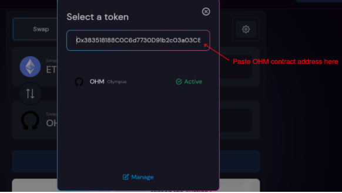
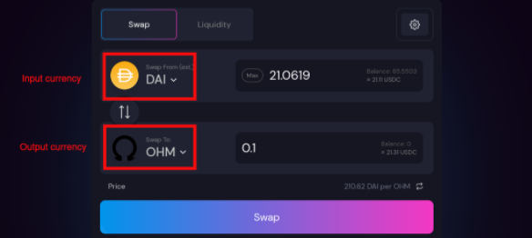

# OHM 스테이킹 \(3,3\)

스테이킹을 하면 자동 복리 적립을 통해 자동으로 OHM을 얻게 됩니다. 올림푸스에서 OHM을 스테이킹하면, sOHM\(staked OHM\)을 1:1 비율로 받게 됩니다. 이후 여러분의 sOHM 잔고는 현재 APY에 따라 매 에포크\(epoch\) 마다 자동으로 증가하게 됩니다.

## OHM 구입 방법

1. [스시스왑](https://app.sushi.com/swap?outputCurrency=0x383518188c0c6d7730d91b2c03a03c837814a899) 페이지로 이동하세요.
2. 스왑하려는 최종 화폐를 OHM으로 설정하세요. 또는, 정확히 설정하기 위해 **OHM 컨트랙트 주소\(**0x383518188c0c6d7730d91b2c03a03c837814a899\)를 추가하세요.

1. 당신의 지갑 잔고에 따라서, 스왑 하려는 화폐를 선택하세요. 슬리피지를 줄이기 위해서 DAI를 선택하는 것을 추천합니다.

1. 얼마만큼의 OHM으로 스왑하기 원하는지 선택한 후, "Approve" 버튼을 클릭해 트랜젝션에 서명하여 기능을 활성화 하세요.
2. "Approve" 트랜젝션이 성공적으로 진행된 후, "Swap" 버튼을 눌러 트랜젝션에 서명하세요.
3. 스왑 트랜젝션이 성공적으로 진행된 후, 지갑 잔고에 OHM이 보일 것입니다. 만약 보이지 않는다면, 지갑에 **OHM 컨트랙트 주소**를 추가하세요.

_알림: "Approve" 트랜젝션은 최초로 OHM을 스왑할 때 단 한번만 필요합니다. 이후의 스왑 과정에서는 "Swap" 트랜젝션만 발생시키면 됩니다._

## 스테이크 방법

1. [올림푸스의 스테이크 페이지](https://app.olympusdao.finance/#/stake)로 접속한 뒤, "Stake" 탭으로 이동합니다.
2. 입력 칸에 스테이크 하려는 OHM 갯수를 입력하세요. 갖고 있는 전체 OHM을 스테이크 하려면 "Max" 버튼을 클릭하세요.
3. "Approve" 버튼을 선택해 트랜젝션에 서명하세요.
4. "Approve" 트랜젝션이 성공적으로 진행된 후, "Stake" 버튼을 클릭하여 트랜젝션에 서명하세요. 이제 성공적으로 OHM이 스테이킹 되었습니다!

## 언스테이크 방법

1. [올림푸스의 스테이크 페이지](https://app.olympusdao.finance/#/stake)로 접속한 뒤, "Unstake" 탭으로 이동합니다.
2. 입력 칸에 언스테이크 하려는 sOHM 갯수를 입력하세요. 갖고 있는 전체 sOHM을 언스테이크 하려 "Max" 버튼을 클릭하세요.
3. "Approve" 버튼을 선택해 트랜젝션에 서명하세요.
4. "Approve" 트랜젝션이 성공적으로 진행된 후, "Unstake" 버튼을 클릭해 트랜젝션에 서명하세요.

_알림: "Approve" 트랜젝션은 최초로 스테이킹/언스테이킹 할 때 단 한번만 필요합니다. 이후의 스테이킹/언스테이킹 과정에서는 "Stake" 또는 "Unstake" 트랜젝션만 발생시키면 됩니다._

## 용어 알아보기

**APY**는 보상 이자를 근거로 계산된 연간 수익 비율을 나타냅니다. 리베이스를 통해 sOHM이 기하급수적으로 증가하는 복리 적립 효과를 통해 계산됩니다.

**TVL**은 올림푸스에 스테이크 되어있는 총 OHM을 달러로 환산한 가치입니다.

**Current Index**는 스테이킹으로부터 얻는 소득을 추적 할 수 있습니다. 인덱스는 에포크 0 일 때 1에서 시작하여 매 에포크마다 증가하는 수치입니다. 만약 당신이 프로토콜이 시작된 시점\(제네시스, 에포크 0\)부터 OHM을 스테이크 했다면, 현재 잔고는 X 배 증가했을 것이고 여기서 X 현재 인덱스\(Current Index\)를 대입하면 됩니다. 당신이 스테이크 하고 또 언스테이크 하는 시점의 인덱스를 기록해 둠으로써 포지션이 얼마나 증가했는지 추적할 수 있습니다. 다시 말하면 언스테이크 시점의 인덱스를 스테이크 시점의 인덱스로 나누어서 sOHM이 얼마나 증가했는지 비율을 알 수 있습니다.

**Your Balance** 지갑에 스테이킹되지 않은 OHM이 얼마나 남아있는지 보여줍니다. 이는 다른 뜻으로 얼만큼의 OHM을 스테이크 할 수 있는지를 보여줍니다.

**Your Staked Balance** 는 지갑에 스테이킹된 OHM이 얼마나 있는지 보여줍니다. 이는 언스테이킹 할 수 있는 OHM이 얼마나 되는지 보여줍니다.

**Next Rebase** 는 다음 리베이스까지 남은 시간을 의미합니다.

**Reward Yield** 는 다음 에포크에서 얼만큼의 sOHM이 증가할지를 여줍니다. 예를 들어 당신이 100 OHM을 스테이킹 했고 다가올 리베이스가 0.5427% 이라면, 당신의 sOHM 잔고는 100에서 100.5427로 늘어날 입니다.

**ROI \(5-Day Rate\)** 는 보상 이자가 동일한 수치로 유지된다는 전제 하에, 5일 뒤에 sOHM 잔고가 얼마나 늘어날지를 예측합니다. 예를 들어 당신이 100 OHM을 스테이크 했고 비율이 8.4577% 이라면, 5일 뒤 OHM 잔고는 100 에서 108.4577로 늘어날 것입니다.

