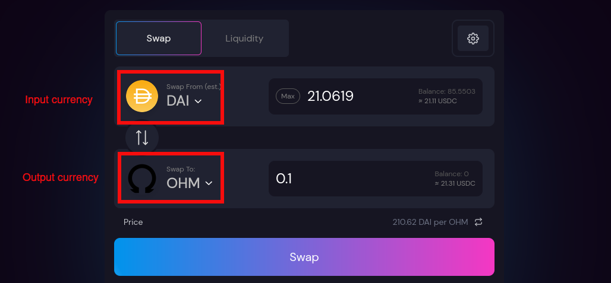

# Staking

Staking allows you to earn OHM passively via auto-compounding. By staking your OHM with OlympusDAO, you receive sOHM in return at a 1:1 ratio. After that, your sOHM balance will increase automatically on every epoch based on the current APY.

## How to Buy OHM

1. Go to [this Sushiswap swap page](https://app.sushi.com/swap?outputCurrency=0x383518188c0c6d7730d91b2c03a03c837814a899).

2. Make sure the output currency is OHM.

3. You can select any input currency based on your available wallet balance. It is recommended to use DAI as the input currency to minimize the slippage.

   

4. Select the amount of OHM you want to swap for. Then click "Approve" and sign the transaction.

5. After the "Approve" transaction has been processed successfully, click "Swap" and sign the transaction.

6. You should see OHM in your wallet balance now after the swap transaction is successful. If you cannot find it in your wallet, add [OHM contract address](https://docs.olympusdao.finance/references/contracts#ohm) to your wallet.

*Note: The "Approve" transaction is only needed when you swap OHM for the first time; subsequent swapping only requires you to perform the "Swap" transaction.*

## How to Stake

1. Go to the [Stake page of the OlympusDAO website](https://app.olympusdao.finance/#/). Select the "Stake" tab.

2. Enter the amount of OHM that you would like to stake in the input field. If you would like to stake all your OHM, press the "Max" button and the input field will be populated with all your available OHM balance.

3. Click "Approve" and sign the transaction.

4. After the "Approve" transaction has been processed successfully, click "Stake" and sign the transaction. Voila, you have staked your OHM!

## How to Unstake

1. Go to the [Stake page of the OlympusDAO website](https://app.olympusdao.finance/#/). Select the "Unstake" tab.

2. Enter the amount of sOHM that you would like to unstake in the input field. If you would like to unstake all your sOHM, press the "Max" button and the input field will be populated with all your available sOHM balance.

3. Click "Approve" and sign the transaction.

4. After the "Approve" transaction has been processed successfully, click "Unstake" and sign the transaction.

*Note: The "Approve" transaction is only needed when staking/unstaking for the first time; subsequent staking/unstaking only requires you to perform the "Stake" or "Unstake" transaction.*

## Reading the Info

**Balance** tells you how many unstaked OHM are in your wallet. This is the maximum amount that you can stake.

**Staked** tells you how many staked OHM are in your wallet. This is the maximum amount that you can unstake.

**Time until rebase** tells you the remaining time until the next rebase.

**Upcoming rebase** tells you how much your sOHM balance will increase when the next epoch begins. For example, if you stake 100 OHM and the upcoming rebase is 0.6389%, your sOHM balance would increase from 100 to 100.6389.

**ROI (5-day rate)** estimates how much your sOHM balance will increase after 5 days, if the upcoming rebase rate stays the same during this period. For example, if you stake 100 OHM and the rate is 10.0250%, your sOHM balance would increase from 100 to 110.025 after 5 days.

**Current APY** tells you the annualized rate of return based on the upcoming rebase rate. It takes into account the effect of compounding since sOHM rebases exponentially.

**Current index** allows you to track your gain from staking. The index starts from 1 at epoch 0, and is increased during every epoch. You can use it to track your position by marking down the index number when you stake and unstake. You divide the index number when you unstake by the index number when you stake to get the ratio by which your sOHM balance has increased.
