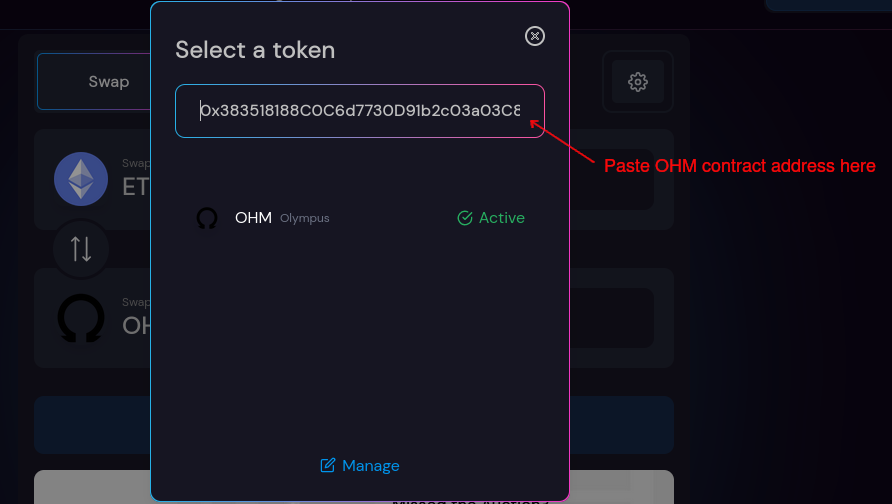
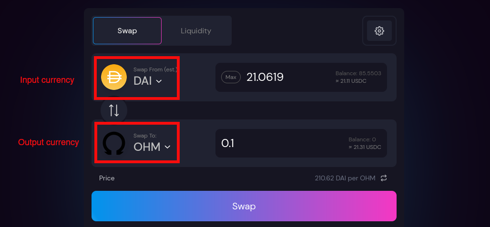

# Stake ses OHM \(3, 3\)

Le staking vous permet de gagner des OHM de manière passive via l'auto-compounding. Vos OHM staked, vous recevez des sOHM en retour à un ratio de 1:1. Ensuite, votre solde de sOHM augmentera automatiquement à chaque époque en fonction de [l'APY](https://app.gitbook.com/@olympusdao-1/s/olympusdocs/~/drafts/-MiWjJjeTgvj-6Lg0VjZ/v/francais/basics/glossary/@drafts#apy) actuel.

Regardez cette vidéo \(anglais\) pour savoir comment obtenir des OHM et les investir sur Olympus :



## Acheter des OHM

1. Aller sur [Paraswap](https://paraswap.io/#/?network=ethereum) \(un aggrégateur de swap qui arbitrera entre Uniswap et Sushiswap\).

2. Assurez-vous de bien acheter du OHM. Vous pouvez également copier et coller [l'adresse du contrat OHM ](https://etherscan.io/address/0x383518188c0c6d7730d91b2c03a03c837814a899)dans le champ de la devise de sortie pour vous assurer que vous échangez contre le bon token.

3. Vous pouvez sélectionner n'importe quelle devise d'entrée en fonction du solde disponible de votre portefeuille. Il est recommandé d'utiliser DAI comme monnaie d'entrée pour minimiser le slippage.

4. Sélectionnez la quantité d'OHM que vous souhaitez échanger. Cliquez ensuite sur "Approuver" et signez la transaction.

5. Une fois que la transaction "Approuver" a été traitée avec succès, cliquez sur "Echanger" et signez la transaction.

6. Vous devriez voir OHM dans le solde de votre wallet maintenant après que la transaction d'échange soit réussie. Si vous ne le trouvez pas dans votre wallet, ajoutez [l'adresse du contrat OHM](https://etherscan.io/address/0x383518188c0c6d7730d91b2c03a03c837814a899).

_Note : La transaction "Approve" n'est nécessaire que lorsque vous échangez des OHM pour la première fois ; les échanges ultérieurs ne nécessitent que la transaction "Swap"._

## Stake

1. Allez sur [OlympusDAO website](https://app.olympusdao.finance/#/). Sélectionner l'onglet "Stake".
2. Entrez le montant des OHM que vous souhaitez stake dans le champ de saisie. Si vous souhaitez miser tous vos OHM, appuyez sur le bouton "Max" et le champ de saisie sera rempli avec tout votre solde d'OHM disponible.
3. Cliquez "Approve" et signer la transaction.
4. Une fois que la transaction "Approuver" a été traitée avec succès, cliquez sur "stake" et signez la transaction. Voilà, vous avez jalonné votre OHM !

## Unstake

1. Allez sur [OlympusDAO website](https://app.olympusdao.finance/#/). Sélectionner l'onglet "unstake".
2. Entrez le montant des sOHM que vous souhaitez unstake dans le champ de saisie. Si vous souhaitez miser tous vos sOHM, appuyez sur le bouton "Max" et le champ de saisie sera rempli avec tout votre solde d'sOHM disponible.
3. Cliquez "Approve" et signer la transaction.
4. Une fois que la transaction "Approuver" a été traitée avec succès, cliquez sur "unstake" et signez la transaction.

_Remarque : La transaction " Approuver " n'est nécessaire que lors du premier jalonnement/détricotage ; les staking / unstaking ultérieurs ne nécessitent que la transaction " Stake " ou " Unstake "._

## Info

**APY** vous indique le taux de rendement annualisé basé sur les récompenses. Il prend en compte l'effet de la capitalisation puisque les OHM rebase de manière exponentielle.

**TVL** mesure le montant en dollars de tous les OHM stake dans Olympus.

**Current Index** permet de suivre les gains obtenus grâce au staking. L'indice part de 1 à l'époque 0, et augmente à chaque époque. Si vous avez stake à la genèse \(époque 0\) et n'avez jamais unstake d'OHM, votre solde aujourd'hui serait X fois plus élevé, où X est l'indice actuel. Vous pouvez utiliser l'indice pour suivre votre position en notant le numéro d'indice lorsque vous stake et unstake. Vous divisez le numéro d'index lorsque vous retirez des fonds par le numéro d'index lorsque vous mettez des fonds pour obtenir le ratio par lequel votre solde de sOHM a augmenté.

**Your Balance** indique le nombre d'OHM mis en jeu dans votre portefeuille. Il s'agit du montant maximum que vous pouvez stake.

**Your Staked Balance** indique le nombre d'OHM staked \(sOHM\).

**Next Rebase** rebase vous indique le temps restant jusqu'au prochain rebase.

**Reward Yield** indique de combien votre solde de sOHM augmentera au début de la prochaine époque. Par exemple, si vous misez 100 OHM et que le prochain rebasement est de 0,5427%, votre solde de sOHM passera de 100 à 100,5427.

**ROI \(5-Day Rate\)** estime de combien votre solde de sOHM augmentera après 5 jours, si le rendement des récompenses reste le même pendant cette période. Par exemple, si vous misez 100 OHM et que le taux est de 8,4577%, votre solde de sOHM passera de 100 à 108,4577 après 5 jours.

