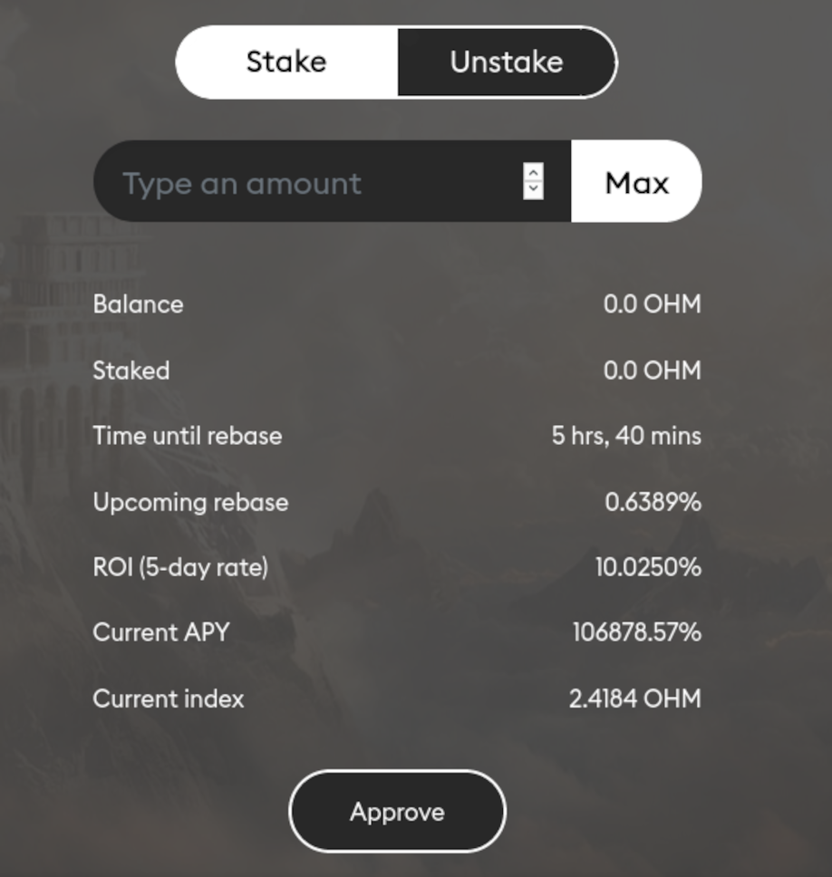

# Staking

Staking allows you to earn OHM passively via compound interest. By staking your OHM with Olympus, you receive sOHM in return at a 1:1 ratio. After that, your sOHM balance will increase automatically on every epoch based on the current APY.

## How to Stake

First, connect your wallet and make sure you've selected "Stake" at the top of the window. Check the Balance line to see how many OHM are available to stake. Type that amount into the field. Next, click approve and sign the transaction. After you've approved, click stake and sign that transaction. **Please note that staking requires two transactions; approve and stake.**

## **How to Unstake**

First, connect your wallet and make sure you've selected "Unstake" at the top of the window. Check the Staked line to see how many sOHM are available to unstake. Type that amount into the field. Next, click approve and sign the transaction. After you've approved, click unstake and sign that transaction. **Please note that unstaking requires two transactions; approve and stake.**

## **Reading the Info**

**Blocks to Next Epoch** tells you how many blocks there are until the next rebase. To determine how long that is, add the block number at the end of this link: https://etherscan.io/block/countdown/xxxxxxxxx. Epochs run for approximately 8 hours each.

**Balance** tells you how many unstaked OHM are in your wallet. This is the maximum amount that you can stake.

**Staked** tells you how many staked OHM are in your wallet. This is the maximum amount that you can unstake.

**Upcoming rebase** tells you how much your balance will increase when the next epoch begins. For example, if you held 100 OHM and the upcoming rebase was 0.6595%, your balance would increase from 100 to 100.6595 OHM.

**Upcoming APY** tells you the annualized rate of the current epoch. Since sOHM rebases exponentially, we display a compounding rate. You can determine this number for yourself with the calculation \( \(1 + rebase\) ^ \(365 \* 3\) \) - 1

**Current index** allows you to track increases from staking. At epoch 0, the index was 1. It has been rebased up during every epoch. You can use it to track your position; just mark down the index number when you stake, and use it to compare every time you check back.
