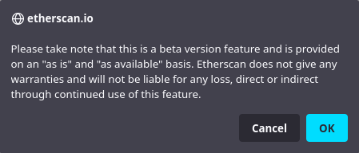

# Unstake LP Tokens

OHM-DAI LP token staking has been deprecated as Olympus owns most of the liquidity now. [Staking rewards are no longer being paid](https://scattershot.page/#/olympusdao.eth/proposal/QmRhBupfD53yBothJ6EarEiL6ztVjSPSfTHRWEpVE7oq3g) to OHM-DAI LP stakers, and users are advised to unstake their OHM-DAI LP tokens from Olympus to prevent any opportunity cost.

As Olympus no longer supports this feature, there is no interface for users to unstake their LP tokens directly from the Olympus website. Luckily, users can still unstake their LP tokens via [Etherscan](https://etherscan.io/). The following guide will show you how.

## How to Unstake LP Tokens via Etherscan

1. Go to the [Write Contract section of the LP staking contract](https://etherscan.io/address/0xF11f0F078BfaF05a28Eac345Bb84fcb2a3722223#writeContract) on Etherscan.

2. Connect your wallet by pressing the **Connect to Web3** button.

3. A warning prompt will pop up from Etherscan. Select **OK**.

4. When your wallet is connected, the button will be changed to show "Connected" along with your wallet address \(redacted in the following screenshot\).

5. Go to the fifth option, _unstakeLP_, and press the **Write** button.

6. Your wallet will prompt you to sign the transaction for unstaking your LP tokens. Confirm the transaction and wait for it to complete.

7. After the transaction has been processed successfully, your LP token balance should show up correctly in your wallet.

