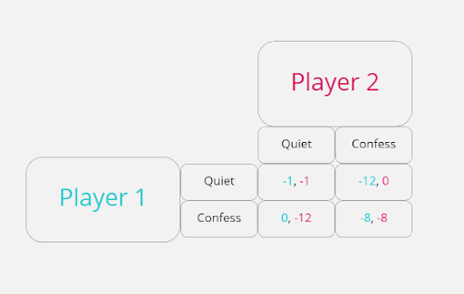
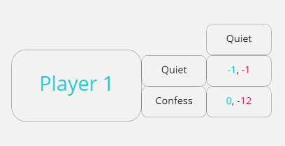
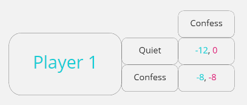
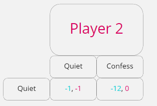
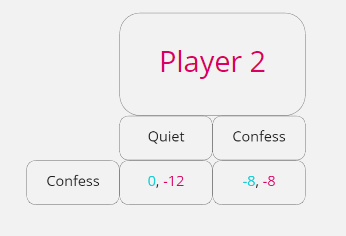
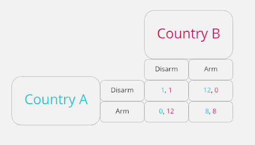
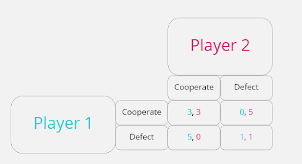
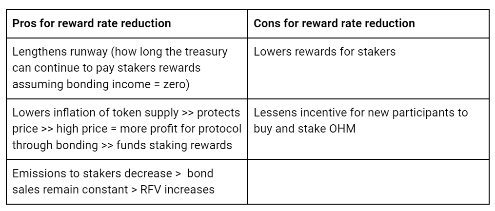

# Olympus Game Theory

kleb

## Introduction

[Olympus](https://www.olympusdao.finance/) is an innovation in the way people
interact with financial protocols. The motivation behind this essay is to delve deep into the Olympus protocol, not from an operational or financial perspective, but with the purpose of analysing human interactions.

There are many fields that have something to say about human interaction but the
field of study we will focus on here will be game theory - the study of strategic interdependence.

It is our belief that Olympus is solving the problem of creating a new currency through internal coordination between different stakeholders within the protocol, without resorting to any policy enforced by a central entity. At its core this is an example of a [prisoner's dilemma](https://en.wikipedia.org/wiki/Prisoner%27s_dilemma). A prisoner's dilemma is a situation where an individual's self interest is in conflict with a common goal, leading to the players within the game not cooperating despite it being in their best interests to cooperate. 

In the case of currency, it is in each individual's best interest to use the most liquid, most widely used & stable currencies. In crypto, the assets that best meet these requirements have been dollar denominated stablecoins. The ‘common goal’ here is to remove reliance on centralized fiat currency and to maintain the individual's purchasing power. These are goals which stablecoins categorically do not achieve and yet still they are some of the most used assets in crypto. No individual acting alone can disentangle crypto from fiat; It takes mass coordination, along with alignment of incentives, and this is what Olympus facilitates.    

We will begin by outlining the essentials of game theory and analysing the prisoner's dilemma from a purely abstract perspective. We will then dive into the specific components of Olympus. We will take no shortcuts. Olympus is a complex protocol that is the first of its kind and is deserving of deep and thorough analysis. 

This is a collaborative piece of work that will be revised over time. It is aimed at a broad range of readers and if you would like to offer feedback or contribute to future sections, please join the Olympus DAO discord and reach out to the Community and Content team. 

## Game Theory Essentials

### What is Game Theory?

Game theory is the study of strategic interdependence. There are many situations
in life where the best response to a situation depends on what other people in
that situation do. Strategic situations are interesting because we can often get
multiple outcomes, some of which are remarkably stable and yet sub-optimal for
all people involved.

Consider a macroeconomic application of multiple stable outcomes under these conditions:
- Firms only invest if customers will buy goods.
- Customers only buy goods if they are paid wages. 
- Customers are  paid wages by firms only if they buy goods. 

The optimistic (non-exhaustive) outcome:
- Firms think customers will buy goods and so expand production.
- Customers buy these goods because they think their wages are secure.
- The expanded profits allow firms to pay higher wages.

The pessimistic outcome:
- Firms do not think customers will buy goods and so restrict production to save costs.
- Customers restrict their purchasing because they lack wage security.
- Firms profits fall, leading to cost cutting in the form of wage cuts and layoffs.

We can see that no one wants to be in the pessimistic outcome and yet it is plausible. To understand why, we use game theory.

### The Model

In essence, a game theoretic model has the following components:

**Players**  
They make choices based on information they hold about themselves, the other players, and the structure of the game. 

**Strategy**  
The full set of choices a player makes in a game. 

**Payoffs**  
A payoff is the reward to each player, contingent upon the outcome of their interactions. We decide payoffs by considering each player's preferences within the game. 

**Payoff Matrix**  
A table that lists all the available strategies and their respective payoffs. 

Game theory is useful because it allows us to determine the optimal strategy which produces the best outcome for all the players involved.

The best way to get to grips with the power of game theory, is with an example. 

## The Prisoner's Dilemma - A Simultaneous Game

The first game any student of game theory learns is the prisoner's dilemma.  This is due to the fact that it is a simple game with applications to a wide variety of strategic situations. Once you see and understand it, you will see it at play everywhere.

### Context

The story goes like this. Two thieves plan to rob a store. As they approach the door, the police arrest them for trespassing. The police suspect that the pair planned to rob the store but they lack the evidence to prove it. They therefore, require a confession to charge the suspects with the more serious crime.
The interrogator separates the suspects and tells them each:

*“We are charging you with trespassing which will land you in jail for a month. I know you were planning to rob the store but I cannot prove it without your testimony. Confess to me now, and I will dismiss your trespassing charge and set you free. Your friend will be charged for the attempted robbery and face 12 months in jail. 
I’m offering your friend the same deal. If you both confess, your individual testimony is no longer valuable and both of you will receive 8 months in jail.”*

Both players are self-interested and want to minimise their jail time. What should they do? 

### Payoff Matrix

Using a payoff matrix allows us to condense all the information into an easy-to-analyse diagram:

Player 1’s available strategies are the rows (Quiet or Confess) and their corresponding payoffs are the first numbers in each cell. 

Players 2’s available strategies are the columns and their corresponding payoffs are the second numbers in the cells. 

If player 1 stays Quiet and player 2 stays Quiet the game ends in the top left corner of the matrix. If both players Confess the game ends in the bottom right corner of the matrix and so on. 
 

### Strategies

To see which strategy each player will choose we should look at each move in isolation. From player 1’s perspective, what should he do if he thinks player 2 will stay Quiet?

We can see that player 1 should Confess because if he stays Quiet he will get one month in jail and we have already stated that both players prefer less time in jail.

What about if player 1 thought that player 2 was going to Confess?

Again it seems that player 1 should Confess as it leads to 8 months jail time rather than the 12 he will receive for keeping quiet.

Putting this together we reach an important conclusion:  
**Player 1 is better off confessing regardless of player 2’s strategy.**  

Let’s look at player 2’s perspective, assuming he thinks player 1 will stay quiet:

Looking at the second numbers now we can see that like player 1, player 2 should confess as well: he will be set free instead of getting 1 month in jail.

Once again it looks like Confess should be the chosen strategy even if player 2 thinks player 1 will also Confess. 

**Player 2 is also better off confessing regardless of player 1’s strategy.**

### Assumptions and Conclusions

- We assumed that both players' preferences were to minimise their jail time 
- We assumed both players were self-interested (i.e they don't care about their friends’ fate)
- We assumed only one interaction
- We assumed the players could not interact and plan their responses in advance 

These assumptions led to a sub-optimal outcome in the game (Confess, Confess). We can see that had both players stayed quiet, they would have received less jail time. This is an **unstable equilibrium** because –as we saw – both players are motivated to confess if they believe the other will stay quiet. 

Confess, Confess is therefore the only Nash equilibrium. A Nash equilibrium is a state in a game where no player wishes to deviate from their strategy, given what the other players are doing.

**If both players were able to cooperate with each other and stay Quiet however, they would have achieved a better outcome. This is an important conclusion as it shows us that two individuals may not cooperate, despite it appearing to be the best strategy for both.**

### Real World Example  

We can apply the model of the prisoner's dilemma to many real world situations. For example imagine the players being replaced with two countries. The strategies available to both countries are to arm themselves with weapons (replacing Confess) or disarm (replacing Quiet). In our first example the payoffs represented jail time. Payoffs do not actually have to represent a ‘real’ thing, they are really just the preferences and assumptions of the players captured in a number. What is important is that the payoffs have meaning relative to each other, and they remain consistent. So in our first game both players preferred lower scores. If we continue to assume that both players (countries) in this game want to minimise their score we get the following matrix:

Following the same steps as in the original game we can see that unfortunately (Arm, Arm) is the only dominant strategy. It is for this reason that efforts to unilaterally disarm are (in this author's opinion) doomed to fail.
The specific payoffs chosen do not matter. What matters is that the relative differences between the payoffs fit our assumptions. Game theory cannot predict the future, it can only illustrate outcomes based on the preferences we set (via the payoffs chosen). 

## The Iterated Prisoner's Dilemma  

In our first example of the prisoner's dilemma, we assumed only one interaction. What changes if we play the game over and over again? 

The single interaction analysed in our first example is not particularly realistic. Life is full of repeated interactions and in the case of Olympus, if it is to achieve its goal of becoming a reserve currency, it will take many repeated interactions. 

For this game we will move away from the story of the prisoners dilemma and focus instead on the payoffs. The best outcome for either player is the highest number. 
Strategies have also changed to cooperate and defect as these are broader terms that better reflect a wide range of real life situations.  

### Payoff Matrix

If you Defect and the other player Cooperates, this will result in the highest payoff the first time. However, continued defection is likely to be met with defection which shifts the players to the bottom right cell - a suboptimal outcome. 

Remember that the specific numbers chosen are unimportant but the relative differences between them are important. Here we are assuming that defection yields a higher payoff than cooperation. We assume this to fulfill the criteria of a prisoner's dilemma -  where an individual's self interest is in conflict with a common goal. An individual is motivated to Defect. However the best possible outcomes over the course of the whole series of games occur when both players **Cooperate continuously**. For proof of this, and if you are interested in playing around with assumptions yourself, please visit [https://ncase.me/trust/](https://ncase.me/trust/).  

This is a crucial finding of the project led by [Robert Axelrod](https://en.wikipedia.org/wiki/Robert_Axelrod). Axelrod ran a tournament where entrants submitted computer programs that played repeated games of the prisoner's dilemma against each other. The payoffs and available strategies in this tournament were identical to those illustrated above. A total of 14 teams entered and each team programmed their entry with some rule set to select the cooperate or defect strategy each move. The tournament was structured as a round robin, so each team played every other team, and each game had 200 moves. Entrants were also paired with their own twin and a RANDOM program which randomly chose to cooperate or defect with equal probability. The tournament was repeated 5 times resulting in 120,000 moves and 240,000 separate choices.  

The scores from those games were tallied up, giving each entrant a final score. The aim was to score as highly as possible after all games had taken place. The winning program was called TIT-FOR -TAT and its strategy was simple:  

**On the first move, cooperate. Then play whichever strategy the opponent played in the previous round.**

The players move simultaneously. So if the opponent defects on the first round, TIT-FOR-TAT would defect on the second. In this way TIT-FOR-TAT can't be easily taken advantage of by other programs repeatedly defecting. Defection will be met with defection.    

It also pays to cooperate with TIT-FOR-TAT, as it will always cooperate in return. Whilst TIT-FOR-TAT can by definition never score higher than its opponent in any one game (because it only ever matches strategies and therefore scores) it still **did better than all other entrants across the whole series of games in the tournament.**  

## Implications of Cooperation being a Dominant Strategy  

The outcome of the iterated prisoner's dilemma tournament has meaningful implications both for wider society and for Olympus. We are often taught that in a capitalist economy, individuals are only concerned with their own self-interest, and therefore selfish and competitive behaviour is the norm. Axelrod’s tournament suggests that cooperation is actually the best way to win. 

For a full analysis of the tournament and its implications I recommend reading Axelrod's book, [‘The Evolution of Cooperation’](https://en.wikipedia.org/wiki/The_Evolution_of_Cooperation). In the following section I will summarise the key components that are, according to Axelrod, necessary for cooperation to develop in decentralized systems.    

## Promoting Cooperation  

How do you establish a system of cooperation amongst strangers with vastly different preferences, who are separated by time and geography, who have never met, and likely never will?  

If you pause to consider this question carefully, you will realise it is a problem humanity has faced since time immemorial. If there is one thing humanity is good at, it is solving problems. Solving the problem of cooperation has powered human prosperity and facilitated our ingenuity. Cooperation has enabled humans to flourish. So how have we learned to cooperate?  

### Reciprocity

A cooperative system must have reciprocity at its core. 

We all have the same basic needs: safety, food, shelter, and social interactions. We all have the same core constraints: 24 hours in a day, a finite lifespan and geographic constraints - at least in the off-chain world. Of course, there are many additional needs and constraints a person may face in their life but what is contextually important is that no one can satisfy all of their needs and overcome their restraints alone. We all need to cooperate to get what we want whether that be through our jobs, our commercial dealings or our social interactions.  

So we are all faced with deciding how to spend our time to satisfy our wants and needs. In economics this is a question of constrained optimisation. Constrained optimization in this context is the process of maximising a given function (e.g utility) in the presence of constraints. The constraint being the time in a day and the activities to be maximised being whatever will give us the highest utility. A person's utility from a good or service is the total amount of satisfaction they receive from that good. The question is what activities do I pursue to get the most from my time? And therefore, what activities do I forgo in order to pursue the ones that will give me greater utility? This is opportunity cost; the forgone benefit that a person would have derived had they taken an action not chosen.  

This leads us to the idea of a mutually beneficial exchange, where both parties exchange a given good (could be their time, money or a physical good) in return for another. Markets and money facilitate exchanges which would otherwise be impossible by greatly increasing the number of exchanges which are possible. This effect is turbocharged by technology like the internet. 

[Nick Szabo](https://unenumerated.blogspot.com/2017/02/money-blockchains-and-social-scalability.html) defines social scalability as the ability of an institution to overcome its shortcomings or constraints that limit how many can successfully participate. Szabo argues that the main social scalability benefit of the internet has been to increase matchmaking in markets meaning that anyone with an internet connection can successfully participate which greatly increases the opportunities for mutually beneficial exchanges.  

No one goes into an exchange willingly giving away a good without expecting to receive one in return. This is the core of reciprocity. We can see this idea of mutually beneficial exchange and reciprocity in the iterated prisoner's dilemma. Tit-for-Tat succeeds because it rewards players who cooperate with it, and quickly punishes those who don't. Over many interactions, this strategy wins out. 

### Reciprocity - Olympus

The most obvious feature of Olympus which promotes reciprocity is staking. By staying staked, OHM holders are essentially cooperating to withhold supply of OHM from the market, and therefore maintaining its price. A consequence of this is the protocol is able to sell OHM (via bonds) at a profit (difference between price of bonded OHM and 1 $DAI) which increases the protocol treasury, a proportion of which is distributed to stakers every 8 hours as sOHM via rebases. The exact equations can be found [here](https://docs.olympusdao.finance/main/references/equations). The reciprocal relationship is thus: I stay staked so the protocol makes a profit, and I receive sOHM in return. 

Initially many people view this dynamic as similar to a ponzi scheme. The claim is that older stakers are rewarded with newer stakers money and that this dynamic will fall apart once older stakers decide to cash out and leave. This is a false assessment for three reasons:

- Stakers are rewarded with newly minted OHM, not whichever asset new entrants used to purchase their OHM. The protocol guarantees to back each OHM with 1 $DAI. Its ability to keep this promise is verifiable by anyone on-chain. The fact that OHM trades at a premium to 1 $DAI is a feature of market sentiment.  

- In a ponzi there is no good or service being created, just money changing hands. Olympus has marketable services in the form of owned liquidity and bonding services for other protocols. As the treasury grows more opportunities will arise for Olympus to generate income.  

- If large quantities of stakers suddenly decided to sell, they would first have to unstake. This raises APY for remaining stakers, limiting the volume of selling but if we imagine a doomsday scenario where everyone continued to sell, those last stakers would still get out with their initial investment and likely some profit (see [Asfi’s bankrun scenario](https://twitter.com/ishaheen10/status/1413369807450247168?s=21)).

Bonding can also be thought of through the lens of reciprocity. 

Bonders buy OHM from the protocol at a discount to the market price. This benefits the protocol by increasing its treasury or protocol owned liquidity (depending on the type of bond purchased). Naturally bonders can also become stakers once they have received their OHM.
The reciprocal relationship is thus: I buy a bond so the protocol increases its treasury, and I receive discounted OHM in return. 

A mutually beneficial exchange has been established between the Olympus protocol, bonders and stakers. 

### Risks to Reciprocity in Olympus

Stakers are incentivised by a high APY. Bonders are incentivised by discounted OHM. Can these incentives break? If so, how likely is it that the reciprocal relationship breaks down? 

#### Stakers Reciprocity  

First let's examine the necessary equations determining APY:

$$
APY = (1+rewardYield)^{1095}
$$

Rebases occur 3 times a day, hence why the APY equation raises to 1095 (365 * 3 = 1095)

$$
rewardYield = OHMdistributed / OHMtotalStaked
$$

$$ 
OHMdistributed = OHMtotalSupply * rewardRate
$$

$$
rewardYield = (OHMtotalSupply * rewardRate) / OHMtotalStaked
$$

The reward rate is subject to change by community vote and can be thought of as the amount that OHMsupply increases per epoch that is then given to stakers. OHM total staked is decided by stakers. OHM total supply is a function of bond sales, staking rewards and minting for the DAO. These variables are exogenous as they are decided by forces outside of the model, so we should examine what happens to reward yield if any of them change and all other variables remain the same.  

If $$ rewardRate $$ **falls** $$ rewardYield $$ **falls**. 
If $$ OHMtotalStaked $$ **falls** $$ rewardYield $$ **rises**. 
If $$ OHMtotalSupply $$ **rises** (but total staked stays constant i.e the percentage of staked OHM falls) $$ rewardYield $$ **rises**.

OHM supply growth is itself a function of staking and bonding. This leaves two scenarios where staking reciprocity could break down: staked percentage falls and/or reward rate falls. 

### Staked Percentage Falls

A break in the reciprocal relationship for staking would be evident by a drop in % staked. The fact that APY **rises** if staked OHM **falls** is a powerful feature which rewards stakers who stay staked and is the likely reason we have not seen OHM total staked fall below 90% (see [Dune dashboard](https://dune.xyz/shadow/Olympus-(OHM))).

### Reward Rate Fall

The other way for the reciprocal relationship in staking to seemingly break down would be for the reward rate to drop thereby bringing down APY. Drops in the reward rate are in fact planned as laid out in [OIP-18](https://forum.olympusdao.finance/d/77-oip-18-reward-rate-framework-and-reduction). 

By lowering the reward rate, the DAO is opting for lower supply inflation over continued high rewards for stakers. This is in line with the overall vision of the protocol to be a stable reserve asset.

The reader will have to decide for themselves whether this constitutes a breaking of the reciprocal relationship between protocol and staker. The fact that there is forward guidance on reductions and they are discussed and voted on suggests more of a changing relationship rather than an all out breaking. 

